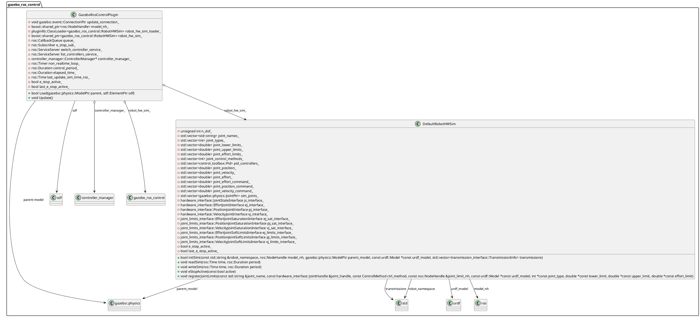

> [!note]
> 通过 gazebo_ros_control_plugin 加载编写的 gazebo_plugin
> 这两部分结合起来，等价于 ros_controller 的角色，在 update() 中顺序执行：
>
> - writeSim()
> - update()
> - writeSim()
>
> ---
>
> robot_hw_sim 等价于 硬件层，用于真正处理于底层硬件/仿真的接口
> 如果底层硬件通过串口，则打开层串口
> 这一层，已经由功能包给实现了，不过也可以自行定义
>
> ---
>
> gazebo_plugin --> controller
> gazebo_ros_control --> load controller + hw_sim

## **You:**

请详细解释一下这段代码，这个 ROS1 中 gazebo_ros_control 的功能包中的代码：

```cpp
// Boost
#include <boost/bind.hpp>

#include <gazebo_ros_control/gazebo_ros_control_plugin.h>
#include <urdf/model.h>

namespace gazebo_ros_control {

GazeboRosControlPlugin::~GazeboRosControlPlugin() {
  // Disconnect from gazebo events
  gazebo::event::Events::DisconnectWorldUpdateBegin(update_connection_);
}

// Overloaded Gazebo entry point
void GazeboRosControlPlugin::Load(gazebo::physics::ModelPtr parent, sdf::ElementPtr sdf) {
  ROS_INFO_STREAM_NAMED("gazebo_ros_control", "Loading gazebo_ros_control plugin");

  // Save pointers to the model
  parent_model_ = parent;
  sdf_ = sdf;

  // Error message if the model couldn't be found
  if (!parent_model_) {
    ROS_ERROR_STREAM_NAMED("loadThread", "parent model is NULL");
    return;
  }

  // Check that ROS has been initialized
  if (!ros::isInitialized()) {
    ROS_FATAL_STREAM_NAMED(
        "gazebo_ros_control",
        "A ROS node for Gazebo has not been initialized, unable to load plugin. "
            << "Load the Gazebo system plugin 'libgazebo_ros_api_plugin.so' in the gazebo_ros package)");
    return;
  }

  // Get namespace for nodehandle
  if (sdf_->HasElement("robotNamespace")) {
    robot_namespace_ = sdf_->GetElement("robotNamespace")->Get<std::string>();
  } else {
    robot_namespace_ = parent_model_->GetName();  // default
  }

  // Get robot_description ROS param name
  if (sdf_->HasElement("robotParam")) {
    robot_description_ = sdf_->GetElement("robotParam")->Get<std::string>();
  } else {
    robot_description_ = "robot_description";  // default
  }

  // Get the robot simulation interface type
  if (sdf_->HasElement("robotSimType")) {
    robot_hw_sim_type_str_ = sdf_->Get<std::string>("robotSimType");
  } else {
    robot_hw_sim_type_str_ = "gazebo_ros_control/DefaultRobotHWSim";
    ROS_DEBUG_STREAM_NAMED(
        "loadThread",
        "Using default plugin for RobotHWSim (none specified in URDF/SDF)\"" << robot_hw_sim_type_str_ << "\"");
  }

  // Get the Gazebo simulation period
  ros::Duration gazebo_period(parent_model_->GetWorld()->GetPhysicsEngine()->GetMaxStepSize());

  // Decide the plugin control period
  if (sdf_->HasElement("controlPeriod")) {
    control_period_ = ros::Duration(sdf_->Get<double>("controlPeriod"));

    // Check the period against the simulation period
    if (control_period_ < gazebo_period) {
      ROS_ERROR_STREAM_NAMED(
          "gazebo_ros_control", "Desired controller update period ("
                                    << control_period_ << " s) is faster than the gazebo simulation period ("
                                    << gazebo_period << " s).");
    } else if (control_period_ > gazebo_period) {
      ROS_WARN_STREAM_NAMED(
          "gazebo_ros_control", "Desired controller update period ("
                                    << control_period_ << " s) is slower than the gazebo simulation period ("
                                    << gazebo_period << " s).");
    }
  } else {
    control_period_ = gazebo_period;
    ROS_DEBUG_STREAM_NAMED(
        "gazebo_ros_control",
        "Control period not found in URDF/SDF, defaulting to Gazebo period of " << control_period_);
  }

  // Get parameters/settings for controllers from ROS param server
  model_nh_ = ros::NodeHandle(robot_namespace_);

  // Initialize the emergency stop code.
  e_stop_active_ = false;
  last_e_stop_active_ = false;
  if (sdf_->HasElement("eStopTopic")) {
    const std::string e_stop_topic = sdf_->GetElement("eStopTopic")->Get<std::string>();
    e_stop_sub_ = model_nh_.subscribe(e_stop_topic, 1, &GazeboRosControlPlugin::eStopCB, this);
  }

  ROS_INFO_NAMED("gazebo_ros_control", "Starting gazebo_ros_control plugin in namespace: %s", robot_namespace_.c_str());

  // Read urdf from ros parameter server then
  // setup actuators and mechanism control node.
  // This call will block if ROS is not properly initialized.
  const std::string urdf_string = getURDF(robot_description_);
  if (!parseTransmissionsFromURDF(urdf_string)) {
    ROS_ERROR_NAMED("gazebo_ros_control", "Error parsing URDF in gazebo_ros_control plugin, plugin not active.\n");
    return;
  }

  // Load the RobotHWSim abstraction to interface the controllers with the gazebo model
  try {
    robot_hw_sim_loader_.reset(new pluginlib::ClassLoader<gazebo_ros_control::RobotHWSim>(
        "gazebo_ros_control", "gazebo_ros_control::RobotHWSim"));

    robot_hw_sim_ = robot_hw_sim_loader_->createInstance(robot_hw_sim_type_str_);
    urdf::Model urdf_model;
    const urdf::Model* const urdf_model_ptr = urdf_model.initString(urdf_string) ? &urdf_model : NULL;

    if (!robot_hw_sim_->initSim(robot_namespace_, model_nh_, parent_model_, urdf_model_ptr, transmissions_)) {
      ROS_FATAL_NAMED("gazebo_ros_control", "Could not initialize robot simulation interface");
      return;
    }

    // Create the controller manager
    ROS_DEBUG_STREAM_NAMED("ros_control_plugin", "Loading controller_manager");
    controller_manager_.reset(new controller_manager::ControllerManager(robot_hw_sim_.get(), model_nh_));

    // Listen to the update event. This event is broadcast every simulation iteration.
    update_connection_ =
        gazebo::event::Events::ConnectWorldUpdateBegin(boost::bind(&GazeboRosControlPlugin::Update, this));

  } catch (pluginlib::LibraryLoadException& ex) {
    ROS_FATAL_STREAM_NAMED("gazebo_ros_control", "Failed to create robot simulation interface loader: " << ex.what());
  }

  ROS_INFO_NAMED("gazebo_ros_control", "Loaded gazebo_ros_control.");
}

// Called by the world update start event
void GazeboRosControlPlugin::Update() {
  // Get the simulation time and period
  gazebo::common::Time gz_time_now = parent_model_->GetWorld()->GetSimTime();
  ros::Time sim_time_ros(gz_time_now.sec, gz_time_now.nsec);
  ros::Duration sim_period = sim_time_ros - last_update_sim_time_ros_;

  robot_hw_sim_->eStopActive(e_stop_active_);

  // Check if we should update the controllers
  if (sim_period >= control_period_) {
    // Store this simulation time
    last_update_sim_time_ros_ = sim_time_ros;

    // Update the robot simulation with the state of the gazebo model
    robot_hw_sim_->readSim(sim_time_ros, sim_period);

    // Compute the controller commands
    bool reset_ctrlrs;
    if (e_stop_active_) {
      reset_ctrlrs = false;
      last_e_stop_active_ = true;
    } else {
      if (last_e_stop_active_) {
        reset_ctrlrs = true;
        last_e_stop_active_ = false;
      } else {
        reset_ctrlrs = false;
      }
    }
    controller_manager_->update(sim_time_ros, sim_period, reset_ctrlrs);
  }

  // Update the gazebo model with the result of the controller
  // computation
  robot_hw_sim_->writeSim(sim_time_ros, sim_time_ros - last_write_sim_time_ros_);
  last_write_sim_time_ros_ = sim_time_ros;
}

// Called on world reset
void GazeboRosControlPlugin::Reset() {
  // Reset timing variables to not pass negative update periods to controllers on world reset
  last_update_sim_time_ros_ = ros::Time();
  last_write_sim_time_ros_ = ros::Time();
}

// Get the URDF XML from the parameter server
std::string GazeboRosControlPlugin::getURDF(std::string param_name) const {
  std::string urdf_string;

  // search and wait for robot_description on param server
  while (urdf_string.empty()) {
    std::string search_param_name;
    if (model_nh_.searchParam(param_name, search_param_name)) {
      ROS_INFO_ONCE_NAMED(
          "gazebo_ros_control",
          "gazebo_ros_control plugin is waiting for model"
          " URDF in parameter [%s] on the ROS param server.",
          search_param_name.c_str());

      model_nh_.getParam(search_param_name, urdf_string);
    } else {
      ROS_INFO_ONCE_NAMED(
          "gazebo_ros_control",
          "gazebo_ros_control plugin is waiting for model"
          " URDF in parameter [%s] on the ROS param server.",
          robot_description_.c_str());

      model_nh_.getParam(param_name, urdf_string);
    }

    usleep(100000);
  }
  ROS_DEBUG_STREAM_NAMED("gazebo_ros_control", "Recieved urdf from param server, parsing...");

  return urdf_string;
}

// Get Transmissions from the URDF
bool GazeboRosControlPlugin::parseTransmissionsFromURDF(const std::string& urdf_string) {
  transmission_interface::TransmissionParser::parse(urdf_string, transmissions_);
  return true;
}

// Emergency stop callback
void GazeboRosControlPlugin::eStopCB(const std_msgs::BoolConstPtr& e_stop_active) {
  e_stop_active_ = e_stop_active->data;
}

// Register this plugin with the simulator
GZ_REGISTER_MODEL_PLUGIN(GazeboRosControlPlugin);
}  // namespace gazebo_ros_control
```

## **ChatGPT4-o:**

这段代码是一个 Gazebo 插件，用于在 ROS1 中结合 Gazebo 仿真和 ROS 控制框架`ros_control`。它实现了一个控制插件`GazeboRosControlPlugin`，主要功能是初始化 ROS 环境，加载机器人硬件接口，并在 Gazebo 仿真中进行控制。以下是对代码的详细解释：

### 包含的头文件

```cpp
#include <boost/bind.hpp>
#include <gazebo_ros_control/gazebo_ros_control_plugin.h>
#include <urdf/model.h>
```

- `boost/bind.hpp`：用于绑定函数对象，主要用于事件连接。
- `gazebo_ros_control/gazebo_ros_control_plugin.h`：包含了插件的声明。
- `urdf/model.h`：用于解析 URDF 模型。

### 插件命名空间

```cpp
namespace gazebo_ros_control {
```

将插件的代码封装在`gazebo_ros_control`命名空间内。

### 析构函数

```cpp
GazeboRosControlPlugin::~GazeboRosControlPlugin() {
  // Disconnect from gazebo events
  gazebo::event::Events::DisconnectWorldUpdateBegin(update_connection_);
}
```

析构函数中断开与 Gazebo 世界更新事件的连接。

### `Load`函数

```cpp
void GazeboRosControlPlugin::Load(gazebo::physics::ModelPtr parent, sdf::ElementPtr sdf) {
  ROS_INFO_STREAM_NAMED("gazebo_ros_control", "Loading gazebo_ros_control plugin");

  // Save pointers to the model
  parent_model_ = parent;
  sdf_ = sdf;
```

- `Load`函数是插件加载时的入口点。
- 保存模型指针`parent_model_`和 SDF 元素指针`sdf_`。

```cpp
  if (!parent_model_) {
    ROS_ERROR_STREAM_NAMED("loadThread", "parent model is NULL");
    return;
  }

  if (!ros::isInitialized()) {
    ROS_FATAL_STREAM_NAMED(
        "gazebo_ros_control",
        "A ROS node for Gazebo has not been initialized, unable to load plugin. "
            << "Load the Gazebo system plugin 'libgazebo_ros_api_plugin.so' in the gazebo_ros package)");
    return;
  }
```

- 检查父模型是否为空，若为空则报错并返回。
- 检查 ROS 是否初始化，若未初始化则报错并返回。

```cpp
  if (sdf_->HasElement("robotNamespace")) {
    robot_namespace_ = sdf_->GetElement("robotNamespace")->Get<std::string>();
  } else {
    robot_namespace_ = parent_model_->GetName();
  }

  if (sdf_->HasElement("robotParam")) {
    robot_description_ = sdf_->GetElement("robotParam")->Get<std::string>();
  } else {
    robot_description_ = "robot_description";
  }
```

- 获取机器人命名空间`robotNamespace`。
- 获取机器人描述参数`robotParam`。

```cpp
  if (sdf_->HasElement("robotSimType")) {
    robot_hw_sim_type_str_ = sdf_->Get<std::string>("robotSimType");
  } else {
    robot_hw_sim_type_str_ = "gazebo_ros_control/DefaultRobotHWSim";
    ROS_DEBUG_STREAM_NAMED(
        "loadThread",
        "Using default plugin for RobotHWSim (none specified in URDF/SDF)\"" << robot_hw_sim_type_str_ << "\"");
  }

  ros::Duration gazebo_period(parent_model_->GetWorld()->GetPhysicsEngine()->GetMaxStepSize());
```

- 获取机器人硬件仿真类型`robotSimType`。
- 获取 Gazebo 仿真周期。

```cpp
  if (sdf_->HasElement("controlPeriod")) {
    control_period_ = ros::Duration(sdf_->Get<double>("controlPeriod"));

    if (control_period_ < gazebo_period) {
      ROS_ERROR_STREAM_NAMED(
          "gazebo_ros_control", "Desired controller update period ("
                                    << control_period_ << " s) is faster than the gazebo simulation period ("
                                    << gazebo_period << " s).");
    } else if (control_period_ > gazebo_period) {
      ROS_WARN_STREAM_NAMED(
          "gazebo_ros_control", "Desired controller update period ("
                                    << control_period_ << " s) is slower than the gazebo simulation period ("
                                    << gazebo_period << " s).");
    }
  } else {
    control_period_ = gazebo_period;
    ROS_DEBUG_STREAM_NAMED(
        "gazebo_ros_control",
        "Control period not found in URDF/SDF, defaulting to Gazebo period of " << control_period_);
  }
```

- 获取控制周期`controlPeriod`，并进行周期合理性检查，确保不快于仿真周期。

```cpp
  model_nh_ = ros::NodeHandle(robot_namespace_);

  e_stop_active_ = false;
  last_e_stop_active_ = false;
  if (sdf_->HasElement("eStopTopic")) {
    const std::string e_stop_topic = sdf_->GetElement("eStopTopic")->Get<std::string>();
    e_stop_sub_ = model_nh_.subscribe(e_stop_topic, 1, &GazeboRosControlPlugin::eStopCB, this);
  }
```

- 初始化 ROS 节点句柄。
- 初始化急停信号，并订阅急停话题。

```cpp
  ROS_INFO_NAMED("gazebo_ros_control", "Starting gazebo_ros_control plugin in namespace: %s", robot_namespace_.c_str());

  const std::string urdf_string = getURDF(robot_description_);
  if (!parseTransmissionsFromURDF(urdf_string)) {
    ROS_ERROR_NAMED("gazebo_ros_control", "Error parsing URDF in gazebo_ros_control plugin, plugin not active.\n");
    return;
  }
```

- 获取 URDF 字符串并解析传动系统。

```cpp
  try {
    robot_hw_sim_loader_.reset(new pluginlib::ClassLoader<gazebo_ros_control::RobotHWSim>(
        "gazebo_ros_control", "gazebo_ros_control::RobotHWSim"));

    robot_hw_sim_ = robot_hw_sim_loader_->createInstance(robot_hw_sim_type_str_);
    urdf::Model urdf_model;
    const urdf::Model* const urdf_model_ptr = urdf_model.initString(urdf_string) ? &urdf_model : NULL;

    if (!robot_hw_sim_->initSim(robot_namespace_, model_nh_, parent_model_, urdf_model_ptr, transmissions_)) {
      ROS_FATAL_NAMED("gazebo_ros_control", "Could not initialize robot simulation interface");
      return;
    }

    ROS_DEBUG_STREAM_NAMED("ros_control_plugin", "Loading controller_manager");
    controller_manager_.reset(new controller_manager::ControllerManager(robot_hw_sim_.get(), model_nh_));

    update_connection_ =
        gazebo::event::Events::ConnectWorldUpdateBegin(boost::bind(&GazeboRosControlPlugin::Update, this));

  } catch (pluginlib::LibraryLoadException& ex) {
    ROS_FATAL_STREAM_NAMED("gazebo_ros_control", "Failed to create robot simulation interface loader: " << ex.what());
  }

  ROS_INFO_NAMED("gazebo_ros_control", "Loaded gazebo_ros_control.");
}
```

- 使用`pluginlib`加载`RobotHWSim`插件。
- 初始化机器人仿真接口。
- 创建控制管理器。
- 连接到 Gazebo 世界更新事件。

### `Update`函数

```cpp
void GazeboRosControlPlugin::Update() {
  gazebo::common::Time gz_time_now = parent_model_->GetWorld()->GetSimTime();
  ros::Time sim_time_ros(gz_time_now.sec, gz_time_now.nsec);
  ros::Duration sim_period = sim_time_ros - last_update_sim_time_ros_;

  robot_hw_sim_->eStopActive(e_stop_active_);

  if (sim_period >= control_period_) {
    last_update_sim_time_ros_ = sim_time_ros;

    robot_hw_sim_->readSim(sim_time_ros, sim_period);

    bool reset_ctrlrs;
    if (e_stop_active_) {
      reset_ctrlrs = false;
      last_e_stop_active_ = true;
    } else {
      if (last_e_stop_active_) {
        reset_ctrlrs = true;
        last_e_stop_active_ = false;
      } else {
        reset_ctrlrs = false;
      }
    }
    controller_manager_->update(sim_time_ros, sim_period, reset_ctrlrs);
  }

  robot_hw_sim_->writeSim(sim_time_ros, sim_time_ros - last_write_sim_time_ros_);
  last_write_sim_time_ros_ = sim_time_ros;
}
```

- 获取仿真时间和周期。
- 处理急停逻辑。
- **读取仿真状态、更新控制器、写入仿真结果**。

### `Reset`函数

```cpp
void GazeboRosControlPlugin::Reset() {
  last_update_sim_time_ros_ = ros::Time();
  last_write_sim_time_ros_ = ros::Time();
}
```

- 在世界重置时重置时间变量。

### 获取 URDF

```cpp
std::string GazeboRosControlPlugin::getURDF(std::string param_name) const {
  std::string urdf_string;

  while (urdf_string.empty()) {
    std::string search_param_name;
    if (model_nh_.searchParam(param_name, search_param_name)) {
      ROS_INFO_ONCE_NAMED(
          "gazebo_ros_control",
          "gazebo_ros_control plugin is waiting for model"
          " URDF in parameter [%s] on the ROS param server.",
          search_param_name.c_str());

      model_nh_.getParam(search_param_name, urdf_string);
    } else {
      ROS_INFO_ONCE_NAMED(
          "gazebo_ros_control",
          "gazebo_ros_control plugin is waiting for model"
          " URDF in parameter [%s] on the ROS param server.",
          robot_description_.c_str());

      model_nh_.getParam(param_name, urdf_string);
    }

    usleep(100000);
  }
  ROS_DEBUG_STREAM_NAMED("gazebo_ros_control", "Recieved urdf from param server, parsing...");

  return urdf_string;
}
```

- 从 ROS 参数服务器获取 URDF 字符串。

### 解析传动系统

```cpp
bool GazeboRosControlPlugin::parseTransmissionsFromURDF(const std::string& urdf_string) {
  transmission_interface::TransmissionParser::parse(urdf_string, transmissions_);
  return true;
}
```

- 解析 URDF 中的传动系统。

### 急停回调

```cpp
void GazeboRosControlPlugin::eStopCB(const std_msgs::BoolConstPtr& e_stop_active) {
  e_stop_active_ = e_stop_active->data;
}
```

- 急停回调函数，更新急停状态。

### 注册插件

```cpp
GZ_REGISTER_MODEL_PLUGIN(GazeboRosControlPlugin);
```

- 将插件注册到 Gazebo 中。

### 总结

这段代码实现了一个 Gazebo 插件，通过 ROS 控制框架`ros_control`与 Gazebo 进行交互，加载和管理机器人控制器，并处理急停等功能。主要步骤包括初始化、加载 URDF、解析传动系统、创建控制管理器，并在仿真过程中周期性地更新控制器和仿真状态。

> [!note]
> 主要是这里有 `writeSim()` 和 `readSim()` 方法可以和 gazebo 进行交互！

---

## **You:**

上面的代码给出的是 ros_control 相关的内容；
下面这段代码是对应 ros_control 中的硬件层，该硬件层是对接 gazebo，即将 gazebo 的仿真作为硬件层，对接接口，`default_robot_hw_sim.cpp`，具体代码如下，请结合上面给出的代码段，综合详细分析：

```cpp
#include <gazebo_ros_control/default_robot_hw_sim.h>

namespace {

double clamp(const double val, const double min_val, const double max_val) {
  return std::min(std::max(val, min_val), max_val);
}

}  // namespace

namespace gazebo_ros_control {

bool DefaultRobotHWSim::initSim(
    const std::string &robot_namespace,
    ros::NodeHandle model_nh,
    gazebo::physics::ModelPtr parent_model,
    const urdf::Model *const urdf_model,
    std::vector<transmission_interface::TransmissionInfo> transmissions) {
  // getJointLimits() searches joint_limit_nh for joint limit parameters. The format of each
  // parameter's name is "joint_limits/<joint name>". An example is "joint_limits/axle_joint".
  const ros::NodeHandle joint_limit_nh(model_nh, robot_namespace);

  // Resize vectors to our DOF
  n_dof_ = transmissions.size();
  joint_names_.resize(n_dof_);
  joint_types_.resize(n_dof_);
  joint_lower_limits_.resize(n_dof_);
  joint_upper_limits_.resize(n_dof_);
  joint_effort_limits_.resize(n_dof_);
  joint_control_methods_.resize(n_dof_);
  pid_controllers_.resize(n_dof_);
  joint_position_.resize(n_dof_);
  joint_velocity_.resize(n_dof_);
  joint_effort_.resize(n_dof_);
  joint_effort_command_.resize(n_dof_);
  joint_position_command_.resize(n_dof_);
  joint_velocity_command_.resize(n_dof_);

  // Initialize values
  for (unsigned int j = 0; j < n_dof_; j++) {
    // Check that this transmission has one joint
    if (transmissions[j].joints_.size() == 0) {
      ROS_WARN_STREAM_NAMED(
          "default_robot_hw_sim", "Transmission " << transmissions[j].name_ << " has no associated joints.");
      continue;
    } else if (transmissions[j].joints_.size() > 1) {
      ROS_WARN_STREAM_NAMED(
          "default_robot_hw_sim", "Transmission "
                                      << transmissions[j].name_
                                      << " has more than one joint. Currently the default robot hardware simulation "
                                      << " interface only supports one.");
      continue;
    }

    std::vector<std::string> joint_interfaces = transmissions[j].joints_[0].hardware_interfaces_;
    if (joint_interfaces.empty() && !(transmissions[j].actuators_.empty()) &&
        !(transmissions[j].actuators_[0].hardware_interfaces_.empty())) {
      // TODO: Deprecate HW interface specification in actuators in ROS J
      joint_interfaces = transmissions[j].actuators_[0].hardware_interfaces_;
      ROS_WARN_STREAM_NAMED(
          "default_robot_hw_sim", "The <hardware_interface> element of tranmission "
                                      << transmissions[j].name_
                                      << " should be nested inside the <joint> element, not <actuator>. "
                                      << "The transmission will be properly loaded, but please update "
                                      << "your robot model to remain compatible with future versions of the plugin.");
    }
    if (joint_interfaces.empty()) {
      ROS_WARN_STREAM_NAMED(
          "default_robot_hw_sim", "Joint " << transmissions[j].joints_[0].name_ << " of transmission "
                                           << transmissions[j].name_ << " does not specify any hardware interface. "
                                           << "Not adding it to the robot hardware simulation.");
      continue;
    } else if (joint_interfaces.size() > 1) {
      ROS_WARN_STREAM_NAMED(
          "default_robot_hw_sim",
          "Joint "
              << transmissions[j].joints_[0].name_ << " of transmission " << transmissions[j].name_
              << " specifies multiple hardware interfaces. "
              << "Currently the default robot hardware simulation interface only supports one. Using the first entry!");
      // continue;
    }

    // Add data from transmission
    joint_names_[j] = transmissions[j].joints_[0].name_;
    joint_position_[j] = 1.0;
    joint_velocity_[j] = 0.0;
    joint_effort_[j] = 1.0;  // N/m for continuous joints
    joint_effort_command_[j] = 0.0;
    joint_position_command_[j] = 0.0;
    joint_velocity_command_[j] = 0.0;

    const std::string &hardware_interface = joint_interfaces.front();

    // Debug
    ROS_DEBUG_STREAM_NAMED(
        "default_robot_hw_sim", "Loading joint '" << joint_names_[j] << "' of type '" << hardware_interface << "'");

    // Create joint state interface for all joints
    js_interface_.registerHandle(hardware_interface::JointStateHandle(
        joint_names_[j], &joint_position_[j], &joint_velocity_[j], &joint_effort_[j]));

    // Decide what kind of command interface this actuator/joint has
    hardware_interface::JointHandle joint_handle;
    if (hardware_interface == "EffortJointInterface") {
      // Create effort joint interface
      joint_control_methods_[j] = EFFORT;
      joint_handle =
          hardware_interface::JointHandle(js_interface_.getHandle(joint_names_[j]), &joint_effort_command_[j]);
      ej_interface_.registerHandle(joint_handle);
    } else if (hardware_interface == "PositionJointInterface") {
      // Create position joint interface
      joint_control_methods_[j] = POSITION;
      joint_handle =
          hardware_interface::JointHandle(js_interface_.getHandle(joint_names_[j]), &joint_position_command_[j]);
      pj_interface_.registerHandle(joint_handle);
    } else if (hardware_interface == "VelocityJointInterface") {
      // Create velocity joint interface
      joint_control_methods_[j] = VELOCITY;
      joint_handle =
          hardware_interface::JointHandle(js_interface_.getHandle(joint_names_[j]), &joint_velocity_command_[j]);
      vj_interface_.registerHandle(joint_handle);
    } else {
      ROS_FATAL_STREAM_NAMED(
          "default_robot_hw_sim", "No matching hardware interface found for '" << hardware_interface);
      return false;
    }

    // Get the gazebo joint that corresponds to the robot joint.
    // ROS_DEBUG_STREAM_NAMED("default_robot_hw_sim", "Getting pointer to gazebo joint: "
    //  << joint_names_[j]);
    gazebo::physics::JointPtr joint = parent_model->GetJoint(joint_names_[j]);
    if (!joint) {
      ROS_ERROR_STREAM("This robot has a joint named \"" << joint_names_[j] << "\" which is not in the gazebo model.");
      return false;
    }
    sim_joints_.push_back(joint);

    registerJointLimits(
        joint_names_[j], joint_handle, joint_control_methods_[j], joint_limit_nh, urdf_model, &joint_types_[j],
        &joint_lower_limits_[j], &joint_upper_limits_[j], &joint_effort_limits_[j]);
    if (joint_control_methods_[j] != EFFORT) {
      // Initialize the PID controller. If no PID gain values are found, use joint->SetAngle() or
      // joint->SetVelocity() to control the joint.
      const ros::NodeHandle nh(model_nh, robot_namespace + "/gazebo_ros_control/pid_gains/" + joint_names_[j]);
      if (pid_controllers_[j].init(nh, true)) {
        switch (joint_control_methods_[j]) {
          case POSITION:
            joint_control_methods_[j] = POSITION_PID;
            break;
          case VELOCITY:
            joint_control_methods_[j] = VELOCITY_PID;
            break;
        }
      } else {
        // joint->SetMaxForce() must be called if joint->SetAngle() or joint->SetVelocity() are
        // going to be called. joint->SetMaxForce() must *not* be called if joint->SetForce() is
        // going to be called.
        joint->SetMaxForce(0, joint_effort_limits_[j]);
      }
    }
  }

  // Register interfaces
  registerInterface(&js_interface_);
  registerInterface(&ej_interface_);
  registerInterface(&pj_interface_);
  registerInterface(&vj_interface_);

  // Initialize the emergency stop code.
  e_stop_active_ = false;
  last_e_stop_active_ = false;

  return true;
}

void DefaultRobotHWSim::readSim(ros::Time time, ros::Duration period) {
  for (unsigned int j = 0; j < n_dof_; j++) {
    // Gazebo has an interesting API...
    if (joint_types_[j] == urdf::Joint::PRISMATIC) {
      joint_position_[j] = sim_joints_[j]->GetAngle(0).Radian();
    } else {
      joint_position_[j] += angles::shortest_angular_distance(joint_position_[j], sim_joints_[j]->GetAngle(0).Radian());
    }
    joint_velocity_[j] = sim_joints_[j]->GetVelocity(0);
    joint_effort_[j] = sim_joints_[j]->GetForce((unsigned int)(0));
  }
}

void DefaultRobotHWSim::writeSim(ros::Time time, ros::Duration period) {
  // If the E-stop is active, joints controlled by position commands will maintain their positions.
  if (e_stop_active_) {
    if (!last_e_stop_active_) {
      last_joint_position_command_ = joint_position_;
      last_e_stop_active_ = true;
    }
    joint_position_command_ = last_joint_position_command_;
  } else {
    last_e_stop_active_ = false;
  }

  ej_sat_interface_.enforceLimits(period);
  ej_limits_interface_.enforceLimits(period);
  pj_sat_interface_.enforceLimits(period);
  pj_limits_interface_.enforceLimits(period);
  vj_sat_interface_.enforceLimits(period);
  vj_limits_interface_.enforceLimits(period);

  for (unsigned int j = 0; j < n_dof_; j++) {
    switch (joint_control_methods_[j]) {
      case EFFORT: {
        const double effort = e_stop_active_ ? 0 : joint_effort_command_[j];
        sim_joints_[j]->SetForce(0, effort);
      } break;

      case POSITION:
#if GAZEBO_MAJOR_VERSION >= 4
        sim_joints_[j]->SetPosition(0, joint_position_command_[j]);
#else
        sim_joints_[j]->SetAngle(0, joint_position_command_[j]);
#endif
        break;

      case POSITION_PID: {
        double error;
        switch (joint_types_[j]) {
          case urdf::Joint::REVOLUTE:
            angles::shortest_angular_distance_with_limits(
                joint_position_[j], joint_position_command_[j], joint_lower_limits_[j], joint_upper_limits_[j], error);
            break;
          case urdf::Joint::CONTINUOUS:
            error = angles::shortest_angular_distance(joint_position_[j], joint_position_command_[j]);
            break;
          default:
            error = joint_position_command_[j] - joint_position_[j];
        }

        const double effort_limit = joint_effort_limits_[j];
        const double effort = clamp(pid_controllers_[j].computeCommand(error, period), -effort_limit, effort_limit);
        sim_joints_[j]->SetForce(0, effort);
      } break;

      case VELOCITY:
        sim_joints_[j]->SetVelocity(0, e_stop_active_ ? 0 : joint_velocity_command_[j]);
        break;

      case VELOCITY_PID:
        double error;
        if (e_stop_active_)
          error = -joint_velocity_[j];
        else
          error = joint_velocity_command_[j] - joint_velocity_[j];
        const double effort_limit = joint_effort_limits_[j];
        const double effort = clamp(pid_controllers_[j].computeCommand(error, period), -effort_limit, effort_limit);
        sim_joints_[j]->SetForce(0, effort);
        break;
    }
  }
}

void DefaultRobotHWSim::eStopActive(const bool active) { e_stop_active_ = active; }

// Register the limits of the joint specified by joint_name and joint_handle. The limits are
// retrieved from joint_limit_nh. If urdf_model is not NULL, limits are retrieved from it also.
// Return the joint's type, lower position limit, upper position limit, and effort limit.
void DefaultRobotHWSim::registerJointLimits(
    const std::string &joint_name,
    const hardware_interface::JointHandle &joint_handle,
    const ControlMethod ctrl_method,
    const ros::NodeHandle &joint_limit_nh,
    const urdf::Model *const urdf_model,
    int *const joint_type,
    double *const lower_limit,
    double *const upper_limit,
    double *const effort_limit) {
  *joint_type = urdf::Joint::UNKNOWN;
  *lower_limit = -std::numeric_limits<double>::max();
  *upper_limit = std::numeric_limits<double>::max();
  *effort_limit = std::numeric_limits<double>::max();

  joint_limits_interface::JointLimits limits;
  bool has_limits = false;
  joint_limits_interface::SoftJointLimits soft_limits;
  bool has_soft_limits = false;

  if (urdf_model != NULL) {
    const boost::shared_ptr<const urdf::Joint> urdf_joint = urdf_model->getJoint(joint_name);
    if (urdf_joint != NULL) {
      *joint_type = urdf_joint->type;
      // Get limits from the URDF file.
      if (joint_limits_interface::getJointLimits(urdf_joint, limits)) has_limits = true;
      if (joint_limits_interface::getSoftJointLimits(urdf_joint, soft_limits)) has_soft_limits = true;
    }
  }
  // Get limits from the parameter server.
  if (joint_limits_interface::getJointLimits(joint_name, joint_limit_nh, limits)) has_limits = true;

  if (!has_limits) return;

  if (*joint_type == urdf::Joint::UNKNOWN) {
    // Infer the joint type.

    if (limits.has_position_limits) {
      *joint_type = urdf::Joint::REVOLUTE;
    } else {
      if (limits.angle_wraparound)
        *joint_type = urdf::Joint::CONTINUOUS;
      else
        *joint_type = urdf::Joint::PRISMATIC;
    }
  }

  if (limits.has_position_limits) {
    *lower_limit = limits.min_position;
    *upper_limit = limits.max_position;
  }
  if (limits.has_effort_limits) *effort_limit = limits.max_effort;

  if (has_soft_limits) {
    switch (ctrl_method) {
      case EFFORT: {
        const joint_limits_interface::EffortJointSoftLimitsHandle limits_handle(joint_handle, limits, soft_limits);
        ej_limits_interface_.registerHandle(limits_handle);
      } break;
      case POSITION: {
        const joint_limits_interface::PositionJointSoftLimitsHandle limits_handle(joint_handle, limits, soft_limits);
        pj_limits_interface_.registerHandle(limits_handle);
      } break;
      case VELOCITY: {
        const joint_limits_interface::VelocityJointSoftLimitsHandle limits_handle(joint_handle, limits, soft_limits);
        vj_limits_interface_.registerHandle(limits_handle);
      } break;
    }
  } else {
    switch (ctrl_method) {
      case EFFORT: {
        const joint_limits_interface::EffortJointSaturationHandle sat_handle(joint_handle, limits);
        ej_sat_interface_.registerHandle(sat_handle);
      } break;
      case POSITION: {
        const joint_limits_interface::PositionJointSaturationHandle sat_handle(joint_handle, limits);
        pj_sat_interface_.registerHandle(sat_handle);
      } break;
      case VELOCITY: {
        const joint_limits_interface::VelocityJointSaturationHandle sat_handle(joint_handle, limits);
        vj_sat_interface_.registerHandle(sat_handle);
      } break;
    }
  }
}

}  // namespace gazebo_ros_control

PLUGINLIB_EXPORT_CLASS(gazebo_ros_control::DefaultRobotHWSim, gazebo_ros_control::RobotHWSim)
```

## **ChatGPT4-o:**

结合`gazebo_ros_control`插件的主要代码和`default_robot_hw_sim.cpp`文件中的硬件层代码，可以全面了解如何通过 ROS 与 Gazebo 仿真环境进行交互。以下是详细分析：

### Gazebo 插件与 ROS 的交互

Gazebo 插件的代码段`gazebo_ros_control.cpp`展示了一个 Gazebo 插件通过 ROS 控制框架`ros_control`与仿真环境进行交互的流程。这段代码实现了**插件的初始化、控制器的加载与更新**等功能。它主要做了以下工作：

1. **初始化**：读取参数、加载 URDF 模型、解析传动系统，并创建控制管理器。
2. **更新回调**：在每个仿真周期内，调用`Update`函数更新控制器的状态，并处理急停等事件。

### `default_robot_hw_sim.cpp`的硬件层实现

`default_robot_hw_sim.cpp`文件实现了一个硬件抽象层，用于**将 Gazebo 的仿真接口与 ROS Control 框架**对接。主要内容如下：

#### 初始化函数`initSim`

```cpp
bool DefaultRobotHWSim::initSim(
    const std::string &robot_namespace,
    ros::NodeHandle model_nh,
    gazebo::physics::ModelPtr parent_model,
    const urdf::Model *const urdf_model,
    std::vector<transmission_interface::TransmissionInfo> transmissions)
```

1. **获取关节限制**：从 URDF 模型和参数服务器中获取关节的限制参数。
2. **初始化变量**：根据传动系统的数量，初始化关节相关的向量。
3. **处理每个传动系统**：
   - 验证每个传动系统是否包含一个关节。
   - 获取关节的硬件接口类型(例如`EffortJointInterface`, `PositionJointInterface`, `VelocityJointInterface`)。
   - 注册关节状态接口和控制接口。
4. **获取 Gazebo 仿真中的关节指针**：并将其存储在`sim_joints_`向量中。
5. **注册关节限制**：调用`registerJointLimits`函数，将关节限制参数注册到适当的接口中。
6. **注册接口**：注册关节状态接口和各种控制接口。
7. **急停初始化**：初始化急停状态变量。

#### 读取仿真状态`readSim()`

```cpp
void DefaultRobotHWSim::readSim(ros::Time time, ros::Duration period)
```

在每个仿真周期内，

- 读取 Gazebo 仿真环境中的关节状态(位置、速度、力)，并
- 更新到硬件层的状态变量中。

#### 写入仿真命令`writeSim()`

```cpp
void DefaultRobotHWSim::writeSim(ros::Time time, ros::Duration period)
```

在每个仿真周期内，根据控制器的命令，向 Gazebo 仿真环境中的关节施加相应的控制命令。具体步骤如下：

1. **处理急停**：如果急停激活，保持关节位置不变。
2. **执行命令限制**：调用限制接口，确保命令在允许范围内。
3. **根据控制方法施加命令**：
   - `EFFORT`：直接施加力。
   - `POSITION`：设置关节位置。
   - `POSITION_PID`：通过 PID 控制器计算力并施加。
   - `VELOCITY`：设置关节速度。
   - `VELOCITY_PID`：通过 PID 控制器计算力并施加。

#### 注册关节限制`registerJointLimits()`

```cpp
void DefaultRobotHWSim::registerJointLimits(
    const std::string &joint_name,
    const hardware_interface::JointHandle &joint_handle,
    const ControlMethod ctrl_method,
    const ros::NodeHandle &joint_limit_nh,
    const urdf::Model *const urdf_model,
    int *const joint_type,
    double *const lower_limit,
    double *const upper_limit,
    double *const effort_limit)
```

该函数从 URDF 模型和参数服务器中获取关节的限制，并将其注册到适当的接口中。根据关节的类型和控制方法，选择软限制或饱和限制接口进行注册。

### 综合分析

这两段代码结合起来展示了一个完整的系统，如何通过 Gazebo 仿真环境进行机器人的硬件抽象与控制：

1. **Gazebo 插件**通过读取 URDF 模型、解析传动系统、创建控制器并在每个仿真周期内更新控制器状态，实现了对机器人的高层次控制。
2. **硬件层**通过从 Gazebo 仿真环境读取关节状态、将控制器命令施加到仿真关节，实现了对机器人的底层控制。

整体架构如下：

1. Gazebo 插件初始化并创建硬件层接口。
2. 硬件层接口通过读取仿真环境的状态，更新关节信息。
3. 硬件层接口根据控制器的命令，向仿真环境施加相应的控制命令。
4. 急停机制确保在紧急情况下，关节状态保持不变，避免危险操作。

通过这种方式，ROS 控制框架和 Gazebo 仿真环境紧密结合，实现了对机器人的仿真控制。这种架构不仅方便测试和开发，还可以在实际硬件不可用时，通过仿真环境进行验证和调试。

---

## **You:**

我希望可以再详细分析这两段代码的结构，给出详细的分析结果

## **ChatGPT4-o:**

好的，我们来详细分析这两段代码的结构，包括`gazebo_ros_control.cpp`插件代码和`default_robot_hw_sim.cpp`硬件层实现代码。

### `gazebo_ros_control.cpp`插件代码结构分析

```cpp
// 相关的头文件和命名空间定义
#include <gazebo_ros_control/gazebo_ros_control_plugin.h>

namespace gazebo_ros_control {

// 插件的构造函数
GazeboRosControlPlugin::GazeboRosControlPlugin() {}

// 插件的析构函数
GazeboRosControlPlugin::~GazeboRosControlPlugin() {}

// 插件加载函数
void GazeboRosControlPlugin::Load(gazebo::physics::ModelPtr parent, sdf::ElementPtr sdf)
{
  // 读取参数并初始化ROS节点句柄
  std::string robot_namespace = "";
  if (sdf->HasElement("robotNamespace"))
    robot_namespace = sdf->GetElement("robotNamespace")->Get<std::string>();

  if (sdf->HasElement("robotSimType"))
    robot_sim_type_str_ = sdf->GetElement("robotSimType")->Get<std::string>();
  else
    robot_sim_type_str_ = "gazebo_ros_control/DefaultRobotHWSim";

  ros::NodeHandle model_nh(robot_namespace);

  // 创建机器人硬件接口
  robot_hw_sim_loader_.reset(new pluginlib::ClassLoader<gazebo_ros_control::RobotHWSim>(
      "gazebo_ros_control", "gazebo_ros_control::RobotHWSim"));

  try {
    robot_hw_sim_ = robot_hw_sim_loader_->createInstance(robot_sim_type_str_);
    if (!robot_hw_sim_->initSim(robot_namespace, model_nh, parent, urdf_model_.get(), transmissions_)) {
      ROS_FATAL("Could not initialize robot simulation interface");
      return;
    }
  } catch (pluginlib::LibraryLoadException &ex) {
    ROS_FATAL_STREAM("Failed to create robot simulation interface loader: " << ex.what());
  }

  // 创建控制器管理器
  controller_manager_.reset(new controller_manager::ControllerManager(robot_hw_sim_.get(), model_nh));

  // 连接更新回调
  update_connection_ = gazebo::event::Events::ConnectWorldUpdateBegin(
      boost::bind(&GazeboRosControlPlugin::Update, this, _1));

  // 初始化仿真周期时间
  last_update_sim_time_ros_ = ros::Time::now();
  ROS_INFO("Loaded gazebo_ros_control.");
}

// 更新函数，每个仿真周期调用一次
void GazeboRosControlPlugin::Update(const gazebo::common::UpdateInfo &info)
{
  // 获取当前仿真时间
  ros::Time sim_time_ros = ros::Time(info.simTime.sec, info.simTime.nsec);

  // 计算时间间隔
  ros::Duration sim_period = sim_time_ros - last_update_sim_time_ros_;
  last_update_sim_time_ros_ = sim_time_ros;

  // 读取仿真状态
  robot_hw_sim_->readSim(sim_time_ros, sim_period);

  // 更新控制器
  controller_manager_->update(sim_time_ros, sim_period);

  // 向仿真施加控制命令
  robot_hw_sim_->writeSim(sim_time_ros, sim_period);
}

} // namespace gazebo_ros_control

// 插件导出宏
GZ_REGISTER_MODEL_PLUGIN(gazebo_ros_control::GazeboRosControlPlugin)
```

### 代码结构详细分析

1. **头文件和命名空间**：

   - 包含相关的头文件，定义命名空间`gazebo_ros_control`。

2. **构造函数和析构函数**：

   - `GazeboRosControlPlugin::GazeboRosControlPlugin()`：插件构造函数，通常用于初始化成员变量。
   - `GazeboRosControlPlugin::~GazeboRosControlPlugin()`：插件析构函数，释放资源。

3. **加载函数`Load`**：

   - 从`SDF`配置文件中读取参数，如`robotNamespace`和`robotSimType`。
   - 初始化 ROS 节点句柄`model_nh`。
   - 创建机器人硬件接口`robot_hw_sim_`。
     - 使用插件加载器`robot_hw_sim_loader_`从`robotSimType`中指定的插件库中加载机器人硬件接口类。
     - 调用硬件接口的`initSim`函数进行初始化。
   - 创建控制器管理器`controller_manager_`。
   - 连接 Gazebo 的更新事件，将其绑定到`Update`函数。
   - 初始化仿真周期时间`last_update_sim_time_ros_`。

4. **更新函数`Update`**：

   - 获取当前仿真时间`sim_time_ros`。
   - 计算时间间隔`sim_period`。
   - 调用硬件接口的`readSim`函数读取仿真状态。
   - 调用控制器管理器的`update`函数更新控制器。
   - 调用硬件接口的`writeSim`函数向仿真施加控制命令。

5. **插件导出宏**：

   - `GZ_REGISTER_MODEL_PLUGIN`：将插件注册到 Gazebo。

### `default_robot_hw_sim.cpp`硬件层实现代码结构分析

```cpp
#include <gazebo_ros_control/default_robot_hw_sim.h>

namespace {
// 辅助函数：对值进行限制
double clamp(const double val, const double min_val, const double max_val) {
  return std::min(std::max(val, min_val), max_val);
}
}  // namespace

namespace gazebo_ros_control {

bool DefaultRobotHWSim::initSim(
    const std::string &robot_namespace,
    ros::NodeHandle model_nh,
    gazebo::physics::ModelPtr parent_model,
    const urdf::Model *const urdf_model,
    std::vector<transmission_interface::TransmissionInfo> transmissions) {

  const ros::NodeHandle joint_limit_nh(model_nh, robot_namespace);

  // 初始化关节相关的向量
  n_dof_ = transmissions.size();
  joint_names_.resize(n_dof_);
  joint_types_.resize(n_dof_);
  joint_lower_limits_.resize(n_dof_);
  joint_upper_limits_.resize(n_dof_);
  joint_effort_limits_.resize(n_dof_);
  joint_control_methods_.resize(n_dof_);
  pid_controllers_.resize(n_dof_);
  joint_position_.resize(n_dof_);
  joint_velocity_.resize(n_dof_);
  joint_effort_.resize(n_dof_);
  joint_effort_command_.resize(n_dof_);
  joint_position_command_.resize(n_dof_);
  joint_velocity_command_.resize(n_dof_);

  // 初始化每个传动系统
  for (unsigned int j = 0; j < n_dof_; j++) {
    if (transmissions[j].joints_.size() == 0) {
      ROS_WARN_STREAM_NAMED(
          "default_robot_hw_sim", "Transmission " << transmissions[j].name_ << " has no associated joints.");
      continue;
    } else if (transmissions[j].joints_.size() > 1) {
      ROS_WARN_STREAM_NAMED(
          "default_robot_hw_sim", "Transmission "
                                      << transmissions[j].name_
                                      << " has more than one joint. Currently the default robot hardware simulation "
                                      << " interface only supports one.");
      continue;
    }

    std::vector<std::string> joint_interfaces = transmissions[j].joints_[0].hardware_interfaces_;
    if (joint_interfaces.empty() && !(transmissions[j].actuators_.empty()) &&
        !(transmissions[j].actuators_[0].hardware_interfaces_.empty())) {
      joint_interfaces = transmissions[j].actuators_[0].hardware_interfaces_;
      ROS_WARN_STREAM_NAMED(
          "default_robot_hw_sim", "The <hardware_interface> element of tranmission "
                                      << transmissions[j].name_
                                      << " should be nested inside the <joint> element, not <actuator>. "
                                      << "The transmission will be properly loaded, but please update "
                                      << "your robot model to remain compatible with future versions of the plugin.");
    }
    if (joint_interfaces.empty()) {
      ROS_WARN_STREAM_NAMED(
          "default_robot_hw_sim", "Joint " << transmissions[j].joints_[0].name_ << " of transmission "
                                           << transmissions[j].name_ << " does not specify any hardware interface. "
                                           << "Not adding it to the robot hardware simulation.");
      continue;
    } else if (joint_interfaces.size() > 1) {
      ROS_WARN_STREAM_NAMED(
          "default_robot_hw_sim",
          "Joint "
              << transmissions[j].joints_[0].name_ << " of transmission " << transmissions[j].name_
              << " specifies multiple hardware interfaces. "
              << "Currently the default robot hardware simulation interface only supports one. Using the first entry!");
    }

    // 添加传动系统的数据
    joint_names_[j] = transmissions[j].joints_[0].name_;
    joint_position_[j] = 1.0;
    joint_velocity_[j] = 0.0;
    joint_effort_[j] = 1.0;
    joint_effort_command_[j] = 0.0;
    joint_position_command_[j] = 0.0;
    joint_velocity_command_[j] = 0.0;

    const std::string &hardware_interface = joint_interfaces.front();

    // 创建关节状态接口
    js_interface_.registerHandle(hardware_interface::JointStateHandle(
        joint_names_[j], &joint_position_[j], &joint_velocity_[j], &joint_effort_[j]));

    // 创建控制接口
    if (hardware_interface == "hardware_interface::EffortJointInterface") {
      joint_control_methods_[j] = EFFORT;
      ej_interface_.registerHandle(hardware_interface::JointHandle(
          js_interface_.getHandle(joint_names_[j]), &joint_effort_command_[j]));
    } else if (hardware_interface == "hardware_interface::PositionJointInterface") {
      joint_control_methods_[j] = POSITION;
      pj_interface_.registerHandle(hardware_interface::JointHandle(
          js_interface_.getHandle(joint_names_[j]), &joint_position_command_[j]));
    } else if (hardware_interface == "hardware_interface::VelocityJointInterface") {
      joint_control_methods_[j] = VELOCITY;
      vj_interface_.registerHandle(hardware_interface::JointHandle(
          js_interface_.getHandle(joint_names_[j]), &joint_velocity_command_[j]));
    } else {
      ROS_FATAL_STREAM_NAMED("default_robot_hw_sim", "No matching hardware interface found for '"
                                                         << hardware_interface << "'");
      return false;
    }

    // 获取Gazebo中的关节
    gazebo::physics::JointPtr joint = parent_model->GetJoint(joint_names_[j]);
    if (!joint) {
      ROS_ERROR_STREAM_NAMED("default_robot_hw_sim", "This robot has a joint named \""
                                                         << joint_names_[j] << "\" which is not in the gazebo model.");
      return false;
    }
    sim_joints_.push_back(joint);

    // 注册关节限制
    registerJointLimits(
        joint_names_[j], js_interface_.getHandle(joint_names_[j]), joint_control_methods_[j], joint_limit_nh, urdf_model,
        &joint_types_[j], &joint_lower_limits_[j], &joint_upper_limits_[j], &joint_effort_limits_[j]);
  }

  // 注册接口
  registerInterface(&js_interface_);
  registerInterface(&ej_interface_);
  registerInterface(&pj_interface_);
  registerInterface(&vj_interface_);

  // 初始化急停变量
  e_stop_active_ = false;
  last_e_stop_active_ = false;

  return true;
}

void DefaultRobotHWSim::readSim(ros::Time time, ros::Duration period)
{
  for (unsigned int j = 0; j < n_dof_; j++) {
    joint_position_[j] += angles::shortest_angular_distance(joint_position_[j], sim_joints_[j]->Position(0));
    joint_velocity_[j] = sim_joints_[j]->GetVelocity(0);
    joint_effort_[j] = sim_joints_[j]->GetForce((unsigned int)(0));
  }
}

void DefaultRobotHWSim::writeSim(ros::Time time, ros::Duration period)
{
  for (unsigned int j = 0; j < n_dof_; j++) {
    if (e_stop_active_) {
      if (!last_e_stop_active_) {
        last_joint_position_command_[j] = joint_position_[j];
        last_e_stop_active_ = true;
      }
      joint_position_command_[j] = last_joint_position_command_[j];
    } else {
      last_e_stop_active_ = false;
    }

    // 应用控制限制
    enforceLimits(period);

    switch (joint_control_methods_[j]) {
      case EFFORT:
        sim_joints_[j]->SetForce(0, joint_effort_command_[j]);
        break;
      case POSITION:
        sim_joints_[j]->SetPosition(0, joint_position_command_[j], true);
        break;
      case POSITION_PID:
        double error;
        double effort;
        error = joint_position_command_[j] - joint_position_[j];
        effort = clamp(pid_controllers_[j].computeCommand(error, period), -joint_effort_limits_[j], joint_effort_limits_[j]);
        sim_joints_[j]->SetForce(0, effort);
        break;
      case VELOCITY:
        sim_joints_[j]->SetVelocity(0, joint_velocity_command_[j]);
        break;
      case VELOCITY_PID:
        double vel_error;
        double vel_effort;
        vel_error = joint_velocity_command_[j] - joint_velocity_[j];
        vel_effort = clamp(pid_controllers_[j].computeCommand(vel_error, period), -joint_effort_limits_[j], joint_effort_limits_[j]);
        sim_joints_[j]->SetForce(0, vel_effort);
        break;
    }
  }
}

void DefaultRobotHWSim::enforceLimits(ros::Duration period)
{
  // 在此处可以实现对关节命令的限制，例如位置、速度和努力限制。
  // 这部分代码省略了具体实现，通常是调用某些库函数来执行这些限制。
}

}  // namespace gazebo_ros_control

// 插件的注册宏
PLUGINLIB_EXPORT_CLASS(gazebo_ros_control::DefaultRobotHWSim, gazebo_ros_control::RobotHWSim)
```

1. **辅助函数**：

   - `clamp`：辅助函数，用于将值限制在最小值和最大值之间。

2. **命名空间`gazebo_ros_control`**：

   - 所有实现都在`gazebo_ros_control`命名空间内，以避免命名冲突。

3. **初始化仿真函数`initSim`**：

   - **参数初始化**：
     - 初始化多个向量来存储关节的名称、类型、限制、命令和状态。
     - `n_dof_`表示自由度的数量(关节的数量)，从传动信息中获得。
   - **传动系统的初始化**：
     - 遍历每个传动系统，检查并提取相关信息，包括关节名称和硬件接口。
     - 为每个关节创建并注册状态接口和控制接口(Effort、Position、Velocity)。
   - **Gazebo 关节获取和初始化**：
     - 从 Gazebo 模型中获取对应的关节对象并存储在`sim_joints_`向量中。
   - **注册关节限制**：
     - 调用`registerJointLimits`函数为每个关节注册位置、速度和努力限制。
   - **注册接口**：
     - 将所有接口(关节状态接口和控制接口)注册到硬件抽象层。
   - **急停变量初始化**：
     - 初始化急停相关的变量`e_stop_active_`和`last_e_stop_active_`。

4. **读取仿真状态函数`readSim`**：

   - 遍历每个关节，更新其位置、速度和努力状态。
   - 使用`angles::shortest_angular_distance`函数计算位置变化。

5. **写入仿真命令函数`writeSim`**：

   - 遍历每个关节，根据控制方法(Effort、Position、Velocity、PID)向 Gazebo 仿真中施加相应的命令。
   - 如果急停激活，则保持最后一个位置命令。
   - 调用`enforceLimits`函数应用控制命令的限制。
   - **控制方法**：
     - **EFFORT**：直接施加力命令。
     - **POSITION**：直接设置关节位置。
     - **POSITION_PID**：使用 PID 控制器计算努力，并施加到关节。
     - **VELOCITY**：直接设置关节速度。
     - **VELOCITY_PID**：使用 PID 控制器计算努力，并施加到关节。

6. **强制限制函数`enforceLimits`**：

   - 对关节命令应用限制，确保命令在合理范围内。
   - 具体实现通常依赖于库函数，在此处省略了具体代码。

7. **插件注册宏**：

   - `PLUGINLIB_EXPORT_CLASS`：将类注册为`gazebo_ros_control::RobotHWSim`插件。

### 总结

这两段代码**实现了一个 Gazebo 仿真插件，用于与 ROS 控制框架集成**。`gazebo_ros_control.cpp`定义了插件的加载和更新逻辑，而`default_robot_hw_sim.cpp`则实现了机器人硬件抽象层的具体功能，包括关节状态的读取和控制命令的写入。通过这些实现，能够在 Gazebo 仿真中运行 ROS 控制器，并模拟机器人的行为。

## **You:**

我期望可以通过 uml 的方式梳理着两段代码的结构关系，请输出 plantuml 的格式

## **ChatGPT4-o:**

要用 PlantUML 表示这两段代码的结构关系，我们可以创建两个类图来展示主要类及其关系。

### PlantUML 格式



### UML 图解释

1. **GazeboRosControlPlugin 类**：

   - 包含加载和更新方法，使用`gazebo::physics::ModelPtr`和`sdf::ElementPtr`作为参数。
   - 具有与`controller_manager::ControllerManager`和`gazebo_ros_control::RobotHWSim`的关系。

2. **DefaultRobotHWSim 类**：

   - 实现了硬件仿真层的初始化、读取和写入仿真命令的方法。
   - 包含多个向量和接口，用于存储和处理关节的各种状态和命令。
   - 与`urdf::Model`、`gazebo::physics::Model`、`ros::NodeHandle`、`std::vector`（用于传动信息）等有关系。

3. **关系**：

   - `GazeboRosControlPlugin`包含并管理`DefaultRobotHWSim`的实例，用于实现硬件抽象层的仿真。
   - `DefaultRobotHWSim`在初始化过程中接收和使用模型、传动信息等，提供硬件接口给控制器管理器。

这样通过 PlantUML 可以清晰地展示出这两个类及其成员之间的关系和依赖结构。
