# Use Manual

V1.2 2022.09

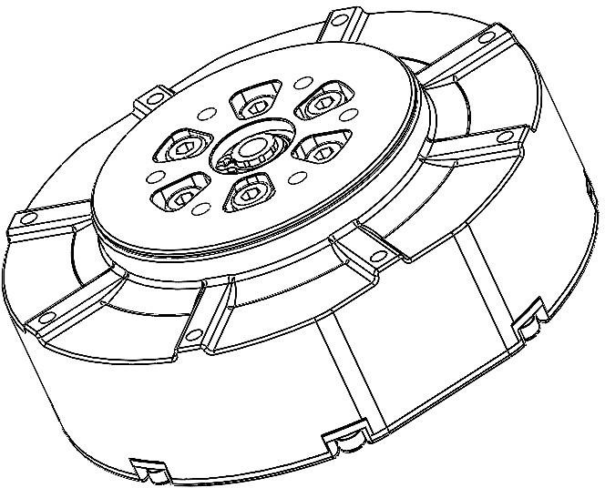{width="5.533596894138233in" height="4.466666666666667in"}

感谢您购买 GO-M8010-6 电机。在使用前，请仔细阅读本声明，一旦使用，即被视为对本声明全部内容的认可和接受。请严格遵循手册使用该产品。因用户不当使用、安装、改装造成的任何损失，杭州宇树科技有限公司将不承担任何责任。

Unitree 是杭州宇树科技有限公司的商标。本文出现的产品名称、品牌等，均为其所属公司的商标或注册商标。本产品及手册为杭州宇树科技有限公司版权所有。未经许可，不得以任何形式复制翻印。

关于不同语言版本的免责声明可能存在的语义差异，中国以中文版为准，其他地区以英文版为准。

{width="0.42083333333333334in" height="0.37974300087489066in"} 重要注意事项 {width="0.37261373578302714in" height="0.37261373578302714in"} 操作、使用提示

_若使用不当，电机扭矩比较大可能会对人身财产造成严重伤害和破坏。因此在使用时，务必注意安全。_

{width="0.42083333333333334in" height="0.37974300087489066in"}_GO-8010-6 电机力矩较大，为了避免潜在的安全风险，务必谨慎操作。非专业用户及未满 18 岁用户请勿使用。_

1.  GO-8010-6 电机最大允许电压为 DC-30V，务必遵守相关安全规范进行操作。
2.  使用时请注意控制电机参数，不要让输出力矩过大或电机末端安装大惯量负载。
3.  使用前请检查好电机是否正常，是否堵转等。如有异常，请及时更换。
4.  使用时要注意电机的温度，双手不要去触摸电机表面以免烫伤。
5.  安装、卸载输出端机械结构时务必断开电机电源。

# 电机概述

永磁同步电机的定子是一个三相对称正弦波绕组，转子上粘贴有永磁体。我们知道，在一个固定的磁场中，永磁体会旋转并固定在一个平行于磁场的方向。一个典型的例子就是在地球磁场下的指南针，指南针会转动到指向地磁南北极的方向。同样的，如果这个固定的磁场开始转动，那么永磁体也会跟着转动，尽量跟随平行磁场方向，这样我们就可以通过旋转磁场来令永磁体旋转到指定角度。同时，永磁体在磁场中产生的力矩大小和永磁体与磁场方向的夹角有关，所以我们也可以通过控制磁场和永磁体的夹角来控制永磁体产生的力矩。

回到电机的角度来说，就是我们可以通过控制定子上三个绕组电压的大小与通断，来控制转子的角度位置和输出力矩。而这种控制方法就是永磁同步电机的矢量控制(**Field-Oriented Control，以下简称 FOC**)。

FOC 控制有许多独特的优势，它可以让我们对永磁同步电机进行"像素级"的控制，实现很多传统电机控制方法所无法达到的效果：

1. 可以在低转速下保持精确控制；
2. 可以很好地实现电机换向旋转；
3. 能够对电机进行力矩、速度、位置三个闭环控制；
4. FOC 控制的永磁同步电机噪音较小。

正如永磁同步电机概述节所述，FOC 控制的基础就是旋转磁场。在图 1 的磁场矢量中，我们看到电机定子的三个线圈 a、b、c 可以产生三个方向的磁场 Ba、Bb、Bc 它们能合成电机中的磁场 B。FOC 控制器根据当前永磁体转子的角度、角速度、期望的输出力矩以及采样测量得到的 a、b、c 三个线圈的电流，计算得到三个线圈的电压通断状态与通断时间，进而通过 MOS 管来控制三个线圈的电压通断。这样就可以合成我们期望的磁场 B，进而拖动电机转子按照我们期望的方式运动。

> 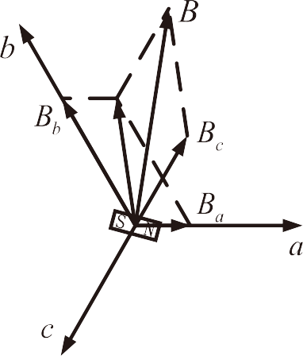{width="1.9911767279090113in" height="2.3333333333333335in"}
> 图 1 FOC 的磁场矢量

# 电机硬件与编码器概述

机器人关节电机的核心构件是电机驱动板、定子、转子和行星减速器。因为电机适合在高转速低力矩的工况下工作，而我们的机器人需要的是低转速高力矩，因此电机转子需要通过一个减速器减速之后，再输出力矩。

编码器(encoder)是用来测量旋转角度的传感器。编码器分为增量编码器、多圈绝对位置编码器与单圈绝对位置编码器等多种。我们在此只详细讨论关节电机实际应用的单圈绝对位置编码器。

关节电机的单圈绝对位置编码器安装在电机转子上。对于单圈绝对位置编码器(以下简称编码器)，可以将它当做一个"时钟表盘"。我们每次看表的时候，都可以读到当前的日期和时间，例如 4 月 1 日 23 点。如果时间经过了 2 个小时，那么时钟转过了 4 月 1 日 24 点，日期会增加 1 天变成 4 月 2 日，时间重新从 0 点开始计时，变成了 4 月 2 日 1 点。为了方便计算经过的时间，我们也可以说现在是 4 月 1 日 25 点。看上去 25 点超过了一天 24 个小时的范围，实际上是因为日期增加了 1 天。

单圈绝对位置编码器也是同样的道理。每次开机上电后，我们的转子可能处于任意位置，编码器会告诉我们转子所处的角度位置(0 至 2𝜋 之间的某个值)。如果转子旋转转过了 2𝜋 这个角度位置，编码器也能够记录转过的圈数增加了 1，从而输出一个超出 0 至 2𝜋 范围的角度位置。看上去编码器也能够输出超过一圈的角度位置，那么为什么叫它"单圈"绝对位置编码器呢？原因在于这种编码器在断电之后不能够储存之前旋转的圈数，我们以下面这个例子来说明。

假设当前编码器输出的角度值为 2.3𝜋，这意味着编码器在开机之后经过了 2𝜋，旋转圈数从 0 变为 1，同时编码器当前位于 0.3𝜋 这个位置。此刻我们将编码器关机，不做任何旋转，再将编码器开机，那么此时编码器输出的角度值就会变为 0.3𝜋。因为关机之后旋转圈数重置为 0，所以编码器只会输出当前位置 0.3𝜋。

# 电机的混合控制

关节电机作为一个高度集成的动力单元，其内部已经封装了电机底层的控制算法。作为用户，只需要给关节电机发送相关的命令，电机就能完成从接收命令到关节力矩输出的全部工作。

对于**电机的底层控制算法，唯一需要的控制目标就是输出力矩**。可是对于机器人，我们通常需要给关节设定位置、速度和力矩。这时就需要对关节电机进行混合控制。

宇树科技的关节电机包含如下 5 个控制指令：

1. 前馈力矩：𝜏𝑓𝑓；
2. 期望角度位置：𝑝𝑑𝑒𝑠；
3. 期望角速度：𝜔𝑑𝑒𝑠；
4. 位置刚度： 𝑘𝑝；
5. 速度刚度(阻尼)：𝑘𝑑。

在关节电机的混合控制中，使用 PD 控制器将电机在输出位置的偏差反馈到力矩输出上：

```
𝜏 = 𝜏𝑓𝑓 + 𝑘𝑝 × (𝑝𝑑𝑒𝑠 − 𝑝) + 𝑘𝑑 × (𝜔𝑑𝑒𝑠 − 𝜔)
```

式中，𝜏 为关节电机的电机转子输出力矩，𝑝 为电机转子的当前角度位置，为 𝜔 电机转子的角速度。在实际使用关节电机时，需要注意将电机输出端的控制目标量与发送的电机转子的指令进行换算。

# 电机的线路连接

我们使用 RS-485 作为物理层，所谓的物理层就是指使用什么物理现象来表达和传输信息。实际上可以将 RS-485 等价与一个半双工的串口(UART)。

RS-485 利用两线之间的电位差来传输数字电平。通常两根线都是等长的双绞线，当外界存在干扰会同时对这对线上产生噪声，差分的电平传到电机内部后，由差分运算放大器对输入[差分电平](https://en.wikipedia.org/wiki/RS-485#Signals)做差还原出原始电平，再传入到串口，这使得通信具有很高的抗干扰能力.

+----------------------------+------------------------+--------------------------+
| **RS-485 signal states** | | |
+============================+========================+==========================+
| **Signal** | **Mark (logic 1)** | **Space (logic 0)** |
+----------------------------+------------------------+--------------------------+
| A | Low | High |
+----------------------------+------------------------+--------------------------+
| B | High | Low |
+----------------------------+------------------------+--------------------------+

_表：[[差分电平]{.underline}](https://en.wikipedia.org/wiki/RS-485#Signals)与逻辑电平的关系_

因为 RS-485 数据线只有两根，用来两路差分信号传输一路电平，所以同一时刻线路上只能进行一个方向的通信，这也是 RS-485 是半双工通信的原因，相对的 4 根数据线全双工差分传输协议是 RS-422，但使用 RS-485 极大的简化了线缆连接，提高了硬件通信可靠性，降低了成本。

通常半双工通信需要一个主机(上位机)来控制通信节奏，主机发送的运动控制指令中含有目标电机 ID 信息，这样每个电机收到运动控制指令都会判断 ID 信息是否符合，符合的电机会将内部的数据信息发送给主机，这样就完成了一轮通信。

Go-M8010-6 电机最大支持一条总线上 15 个电机(ID 0~14)，总线上不得有 ID 相同的电机，否则整条总线通讯都会异常，电机 ID 的配置请参照 6.2。

为了将运动控制指令发送给宇树科技制造的关节电机，我们需要通过串口将指令下发。电机通过 RS-485 接口与上位机进行通信，固定波特率 (Baud Rate)为：4Mbps。为了方便用户使用，我们会提供 USB 转 RS-485 的转接器。

> 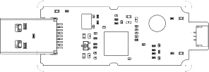{width="1.1771237970253718in" height="0.4077580927384077in"}
> 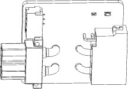{width="0.8062795275590551in" height="0.5561122047244095in"}
> 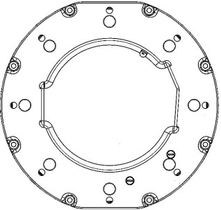{width="1.5913429571303588in" height="1.5194499125109362in"}
> 图 2 电机线路连接

如图 2 所示。提供给用户的接口使用 C(XT30(2+2)线缆)，连接至 B (XT30(2+2)转接板)，并通过 D(GH1.25-3 线缆)连接到 A(485 转 USB 模块)并连接到电脑上。

在通过自己的电脑控制电机时，为了将指令从上位机发送到电机，需要将 RS-485 接口通过 USB 转 RS-485 转接口连接到上位机。在接通 24V 直流电源后，电机绿色指示灯开始闪烁，说明电机已开机。

{width="0.420832239720035in" height="0.37974300087489066in"}_请在上电前检查供电电源，请勿让供电电源高于 30V ，并检查电源供电能力是否充足。_

# 电机规格参数

| 功能                   | 参数                           |
| ---------------------- | ------------------------------ |
| 型号                   | GO-M8010-6                     |
| 尺寸大小(长 x 宽 x 高) | 96.5x92.5x42.3mm               |
| 重量                   | 约 530g                        |
| 工作电压               | 12V~30VDC，推荐 24VDC          |
| 最大相电流             | 40A                            |
| 最大扭矩               | 23.7NM                         |
| 最大转速               | 30 rad/s(24V 供电时)           |
| 转矩常数               | 0.63895 Nm/A                   |
| 减速比                 | 1:6.33                         |
| 通信方式               | 高速 485                       |
| 通信波特率             | 4Mbit/s                        |
| 通信控制频率           | 6KHz                           |
| 温度传感器             | 有                             |
| 转子绝对值式编码器     | 15bit                          |
| 电机感知反馈           | 力矩, 角度, 角速度, 温度       |
| 电机控制指令           | 力矩, 角度, 角速度, 刚度, 阻尼 |
| 使用环境               | -5°C~40°C                      |

# 电机的配置

## [查看串口名]{.underline}

将 USB 转 RS-485 转接口连接在上位机上时，上位机会为这个串口分配一个串口名。在 Linux 系统中，这个串口名一般是以"ttyUSB"开头，在 Windows 系统中，串口名往往以"COM"开头。

在 Linux 系统中，一切外接设备都是以文件形式存在的。USB 转 RS-485 转接器也可以被视为 `/dev` 文件夹下的一个"文件"。打开任意一个终端窗口(在 Ubuntu 下快捷键为 Ctrl+Alt+t 组合键)，运行如下命令：

其中 `cd /dev` 命令将当前文件夹切换为 `/dev`， `ls \|grep ttyUSB` 命令显示当前文件夹下所 有文件名包含 ttyUSB 的文件，其中的 \| 符号就在键盘的回车键上方，按住 Shift+\\即可键入"\|"字符。运行如上命令后，即可得到上位机当前连接的串口名。例如图 3 所示，当前上位机连接的串口名为 ttyUSB0。考虑到串口所在的文件夹路径，其完整的串口名为`/dev/ttyUSB0`。

> 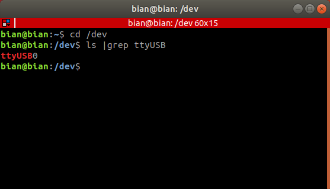{width="5.743986220472441in" height="3.2896872265966755in"}
> 图 3 Ubuntu 系统查看串口名

{width="0.37261373578302714in" height="0.37261373578302714in"}串口名的序号和插入设备的顺序一致，对于连接多个设备这很有帮助。

## [获取电机工具箱]{.underline}

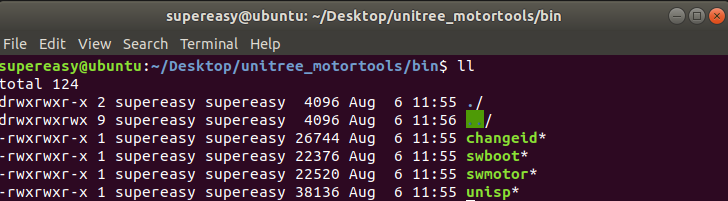{width="5.76462489063867in" height="1.59125in"}解压 Unitree MotorTools 工具箱，进入 bin 文件夹后可以看到一些可执行程序，这里提供了常见的一些对电机修改的工具。

这时我们将电机 XT30 2+2 接口连接到电机上，USB 转 RS-485 转接器连接到计算机，并给电机供电，下一步即可开始配置电机。

{width="0.420832239720035in" height="0.37974300087489066in"}_使用 Unitree MotorTools 时，请确保 RS485 总线上只有一个电机，并且没有其他主机在工作(向总线发送数据)_

## [查看电机 ID]{.underline}

查看和修改电机 ID 需要将电机切换到**工厂模式**，切换前请确保所有电机已经停止工作，主机也不再向电机发送运动控制指令。

稍等片刻，进入工厂模式的电机背部绿色指示灯会变成每秒快速闪烁 3 次的状态，此时终端上会显示所有已经进入工厂模式的电机。

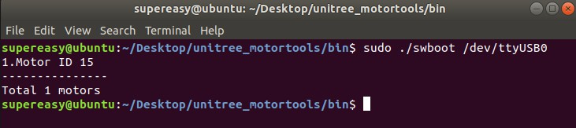{width="5.568089457567804in" height="1.239478346456693in"}

正常情况，打印的列表中不会有 **ID 大于 15** 的电机。如果这发生了请重新给电机上电再试一次。

如果存在 ID 为 15 的电机，则说明该电机还没有设置 ID，您可以参照 6.4 配置。

## [更改电机 ID]{.underline}

要修改电机的 ID 需要使用 changeid 命令，用法为：

```
changeid [串口号] [原来的 ID] [要修改的 ID] changeid /dev/ttyUSB0 0 1 :设置电机 ID0 为 ID1
```

切换前请确保所有电机已经停止工作，主机也不再向电机发送运动控制指令。

例如：将总线上所有 ID 为 15 的电机修改为 ID 0

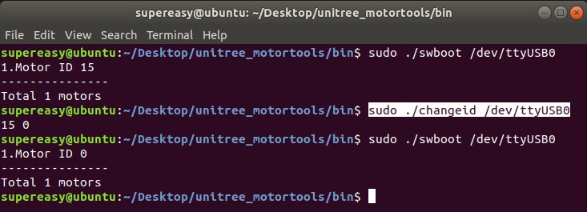{width="5.87913167104112in" height="2.125520559930009in"}

## [电机固件升级]{.underline}

Go-M8010-6 电机支持升级电机固件，方便后期提高电机性能和安全修复，您可以将宇树科技提供给您的固件文件使用 unisp 工具下载到电机中。要升级电机固件需要使用 unisp 命令，用法为：

```
unisp [串口号] [.bin 升级文件] [要刷入的电机 ID] unisp /dev/ttyUSB0 ./GoM80106_v1.0.bin 0
```

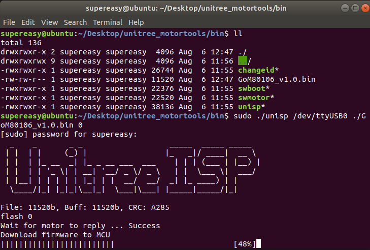{width="6.081159230096238in" height="4.1in"}

{width="0.420832239720035in" height="0.37974300087489066in"}_请不要给电机下载来历不明的电机固件，这是非常危险的行为。风险不仅限于电机变砖、意外伤人、烧毁电机、丧失质保等等_

## [切换回电机模式]{.underline}

查看和修改电机 ID 会让电机切换到工厂模式，如果不手动切换回电机模式，即使给电机重新上电也还会进入工厂模式。

进入工厂模式的电机背部绿色指示灯会变成每秒快速闪烁 3 次的状态。此时使用命令 ./swmotor 即可切换到电机模式，用法为：

```
swmotor [串口号] swmotor /dev/ttyUSB0
```

即可让该 RS485 总线上所有的电机切换到电机模式，此时电机就可以接收运动控制指令了。

{width="0.37261373578302714in" height="0.37261373578302714in"}没有固件的电机不会被启动，并且会在终端上显示。

# 电机的控制

SDK 目前支持以下平台和系统：

1. x86/x64 平台下 Linux 系统
2. ARM64 平台下 Linux 系统

UnitreeMotorSDK 下载地址：[[https://dev-motor.unitree.com/sdkUse/?highlight=ARM]{.underline}](https://dev-motor.unitree.com/sdkUse/?highlight=ARM)

在每一个支持下，都提供 C++的代码示例，用户只需要仿照示例 就能完成对电机的控制。下面我们演示如何控制电机。

## [C++ 范例试运行]{.underline}

下面我们尝试让电机转起来。

首先打开 src 文件夹下的 main.cpp 文件，第一步要做的就是修改串口名。如果只在一个系统下运行，那么只修改这一系统下的串口名即可：

```cpp
SerialPort _ioPort("/dev/ttyUSB0");
```

接下来是声明发送给电机的命令和从电机接收回来的状态：

```cpp
MotorCmd cmd;
MotorData data;
```

其中 cmd 是给电机发送的控制命令包，它们都是 MotorCmd 类型的结构体。所谓结构体，即包含了许多不同类型数据的数据包，我们马上就会展示针对结构体的操作。同理 data 是接收电机状态信息的数据包，它是一个 MotorData 类型的结构体。关于这两个结构体的具体内容，可以参考 include/unitreeMotor/unitreeMotor.h 文件，在此不再赘述。

接下来我们修改 cmd。首先解释一下 MotorCmd 类型结构体包含的数据：

1. Id：当前控制命令的目标电机 ID；
2. mode: 目标电机运行模式。 0.停止 1.FOC 2.电机标定；
3. T: 前馈力矩 `𝜏_𝑓𝑓`:
4. W 指定角速度 `𝜔_𝑑𝑒𝑠`；
5. Pos: 指定角度位置 `𝑝_𝑑𝑒𝑠`；
6. K_P: 位置刚度 `𝑘𝑝`；
7. K_W: 速度刚度(阻尼)`𝑘𝑑`。

当 mode 的值为 0 时，后面的 5 个控制参数并没有任何作用。当 mode 的值为 2 时，表示进行电机标定。在这个例子中我们将 mode 的值设为 1。这里我们让电机以恒定的速度旋转，完整的代码为：

```cpp
cmd.motorType = MotorType::Go2;
cmd.id = 0;
cmd.mode = 1;

cmd.T = 0.0;
cmd.W = 6.28 * 6.33;
cmd.K_P = 0;
cmd.K_W = 0.02;

_ioPort.sendRecv(&cmd, &data);
```

下面我们就可以给电机发送命令了，控制命令会通过 `_ioPort` 对象的 `sendRecv(&cmd,&data)`函数给电机发送一次控制命令，并接收一次电机的当前状态信息。

_此处需要**特别注意**的是，给电机发送的命令都是针对减速器之前的电机转子，即图 5 中的转轴 1。而不是经过减速之后的输出轴 2。所以在进行实际控制的过程中，一定要注意考虑**电机的减速比**。在 GO-8010-6 的电机中，**减速比为 6.33**。_

> 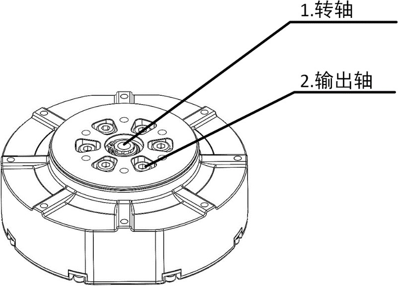{width="3.588338801399825in" height="2.58in"}
> 图 4 电机输出端

## [位置模式]{.underline}

在位置模式下，电机的输出轴将会稳定在一个固定的位置。例如，如果我们希望电机输出端固定在 3.14 弧度的位置，可以将控制参数如下设置：

```cpp
// 位置模式下这里给 0
cmd.T = 0.0;
cmd.W = 0.0;
// 输入指定的目标位置
cmd.Pos = 3.14*6.33;
// kp: 比例系数, kw: 微分系数
cmd.K_P = 0.02;
cmd.K_W = 0.0;
```

在上述参数设置中，将 T 与 W 设置为 0，即可成为针对 Pos 的 PD 控制。其中 K_P 为比例系数，K_W 为微分系数，6.33 为减速比。

再尝试完成上述修改后，重新编译并运行相关可执行文件，即可从电机返回的状态看出，电机转子的位置稳定在 3.14 × 6.33 弧度，即电机输出端固定在 3.14 弧度的位置。可知，如果目标位置和当前位置之间差距很大，那么电机产生的力矩 𝜏 也会很大，从而产生一个很大的电流。如果给电机供电的电源的输出电流上限较小，可能会出现电源保护，即电机停止旋转。此时就需要考虑让 `cmd.Pos` 缓慢变化，避免产生瞬间的极大力矩。

## [速度模式]{.underline}

在速度模式下，电机的输出轴将会稳定在一个固定的速度。令电机输出轴转速稳定在 `6.28rad/s`：

```cpp
// 速度模式下设置为 0
cmd.T = 0.0;
cmd.Pos = 0.0;
// 指定角速度
cmd.W = 6.28*6.33;
// 速度控制的比例系数
cmd.K_W = 0.02;
// ?应该是没有作用吧，因为是速度模式
cmd.K_P = 0.0;
```

速度模式 T 和 K_P 必须为 0，这样就构成了对 W 的 P 控制。其中 K_W 为速度的比例系数。

## [阻尼模式]{.underline}

阻尼模式是一种**特殊的速度模式**。当我们令 W = 0.0 时，电机会保持转轴速度为 0。并且在被外力旋转时，产生一个**阻抗力矩**。这个力矩的方向与旋转方向相反，大小与旋转速度成正比。当停止外力旋转后，**电机会静止在当前位置**。因为这种状态和线性阻尼器类似，所以被称为阻尼模式。

```cpp
cmd.T = 0.0;
cmd.W = 0.0;
cmd.Pos = 0.0;
cmd.K_P = 0.0;
// 对速度的刚度系数？
cmd.K_W = 0.02;
```

## [力矩模式]{.underline}

在力矩模式下，电机会持续输出一个**恒定力矩**。但是当电机空转时，如果给一个较大的目标力矩，电机会持续加速，直到最大速度，这时也仍然达不到目标力矩。

下面提供一个无负载情况下比较安全的力矩模式参数设置：

```cpp
// 前馈力矩
cmd.T = 0.05;
//
cmd.W = 0.0;
cmd.Pos = 0.0;
cmd.K_P = 0.0;
cmd.K_W = 0.0;
```

在该参数下，可以观察到电机**在恒定力矩下逐渐加速的过程**。因为各个电机之间存在细微差异，如果电机无法顺利旋转，可以适量增大 T 的数值或用手轻轻助推一下。

## [零力矩模式]{.underline}

零力矩模式是一种特殊的力矩模式。当我们将命令修改为下列设置时，电机会**保持转轴的力矩为 0**：

```cpp
// 零力矩
cmd.T = 0.0;
//
cmd.W = 0.0;
cmd.Pos = 0.0;
cmd.K_P = 0.0;
cmd.K_W = 0.0;
```

此时电机并不是停止运转，而是**主动产生力矩来抵抗自身的摩擦力矩**。在零力矩模式下，尝试转动输出轴，会感觉**输出轴的阻力明显小于未开机时的阻力**。

## [力位混合模式]{.underline}

在四足机器人的实际控制时，机器人运动控制器往往会给关节同时发送前馈力矩 `𝜏_𝑓𝑓`、目标角度 `𝑝_𝑑𝑒𝑠` 和目标角速度 `𝜔_𝑑𝑒𝑠`。这时的控制模式就是力位混合控制，这也是我们在后面的实际应用中使用最多的一种控制模式。

# 移植到其他上位机平台

考虑到部分用户会使用特殊的上位机平台来控制电机，在此我们也会讲解如何编写自己的电机控制程序。根据本节所述的方法，读者可以在任意满足硬件要求的平台上给电机发送控制命令并接收电机状态。

## [通信配置]{.underline}

GO-M8010-6 电机采用串口通信，通信标准为 RS-485，波特率为 4.0 Mbps。串口的数据位为 8 bit，无奇偶校验位，停止位为 1 bit。需要注意的是为了提高电机的通信频率，我们使用了 4.0 Mbps 这一很高的波特率，用户需要检查自己的硬件是否支持这么高的波特率。

如果您的硬件无法支持该波特率，可以使用 Unitree 提供的 USB 转 RS-485 模块。

## [电机运动控制指令格式]{.underline}

在控制电机时，我们会通过串口给电机发送一个长度为 **17 字节** 的命令，之后电机会返回一个长度为 **16 字节**的信息。如果不给电机发送命令，那么电机也不会返回状态。给电机发送命令的格式如表 1，电机返回的状态格式如**表 2** 所示。这两个表中详细介绍了收发报文中各个字节表示的含义，下面我们会解释其中的部分细节。

首先是发送给电机命令中的第 11、12 字节，这两个字节表示了电机前馈力矩 𝜏𝑓𝑓，显然前馈力矩 𝜏𝑓𝑓 是一个浮点数，即 float 型，一个 **float 型浮点数需要占用 4 个字节**。为了节约通信带宽，我们**用 2 个字节来表示浮点数**，我们使用的方法是移位操作，在此不对具体原理展开讲解。从应用的角度，读者可以认为我们对前馈力矩乘了 256，之后赋值给一个 2 个字节的 `signed short int` 型，即带符号的短整形变量。在这个赋值过程中会强制取整，这样我们就可以只用两个字节来发送前馈力矩 𝜏𝑓𝑓，当电机接收到这个数据后，只需要除以 256，就能获得前馈力矩 𝜏𝑓𝑓 的数值。这种操作虽然**会丧失一些精度**，但是对于实际应用是完全足够的。另外需要注意的一点就是，对于一个长度为 2 字节的变量，一共有 16 个字符，即 16 位。其中 1 位用来表示正负，是符号位，所以只有 **15 位用于表示数值的大小**，这意味着命令中 **T 数值不能大于 215**。考虑到我们曾经对原始数据 𝜏 乘了 256，所以其绝对值存在上限：

```
|𝜏𝑓𝑓| < (2^15/256) = 128
```

同时需要注意的是，由于在赋值过程中存在强制取整，所以 𝜏𝑓𝑓 的数值越大，保存的小数精度越低。表 1 中变量 T 的说明里所说的 X 256 倍描述指的就是上文中所说的乘 256，其他变量中所说的某某倍描述也与之同理。

并且，对于 2 个字节的 𝜏 变量来说，它的**低位在前，即第 13 字节，高位在后，即第 14 字节**。在发送命令和接收状态的末尾，我们可以看到一个 **2 字节的 crc_ccitt 校验**。在命令发送之前，我们会计算这些命令字节的发送前 crc 校验值，并且和命令一起发送给电机。当电机收到命令之后，还会根据收到的命令计算发送后 crc 校验值。

如果数据传输过程中没有发生任何错误，那么**发送前 crc 校验值等于发送后 crc 校验值**。如果在数据传输过程中出现了数据错误，那么发送后 CRC 校验值的计算结果就与发送前 CRC 校验值不相等，电机就能够知道数据发生了损坏，从而帮助我们避免错误数据。读者可以直接参考 Linux 内核中关于 [crc_ccitt](https://github.com/torvalds/linux/blob/master/lib/crc-ccitt.c) 函数的源码。

> 表 1 主机侧控制协议
> 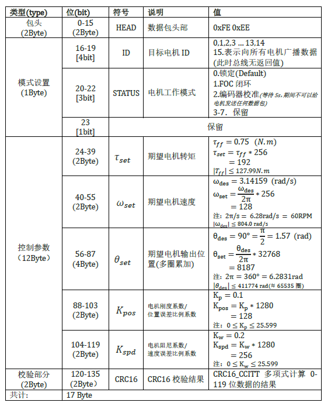

_为了保证标定效果，切换到编码器校准模式后，需要等待 5s 再进行通信(期间不可以给电机发送任何数据包，否则会标定失败)_

> 表 2 电机端反馈数据
> 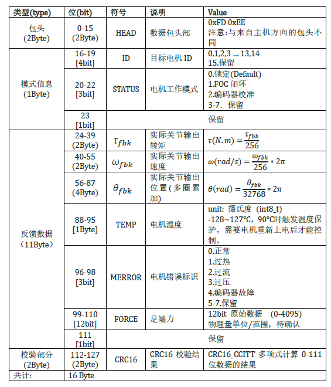

_通讯协议内所有的数据类型都为整形，具体大小请参照上表"位(bit)"项描述。请确保控制主机处理器平台为小端(LSB)模式。_

_没有特殊说明，表中参数都为关节电机的电机转子侧，而非输出端。_

您可以在宇树官方网站上查询最近版本[用户手册](https://www.unitree.com/cn)
