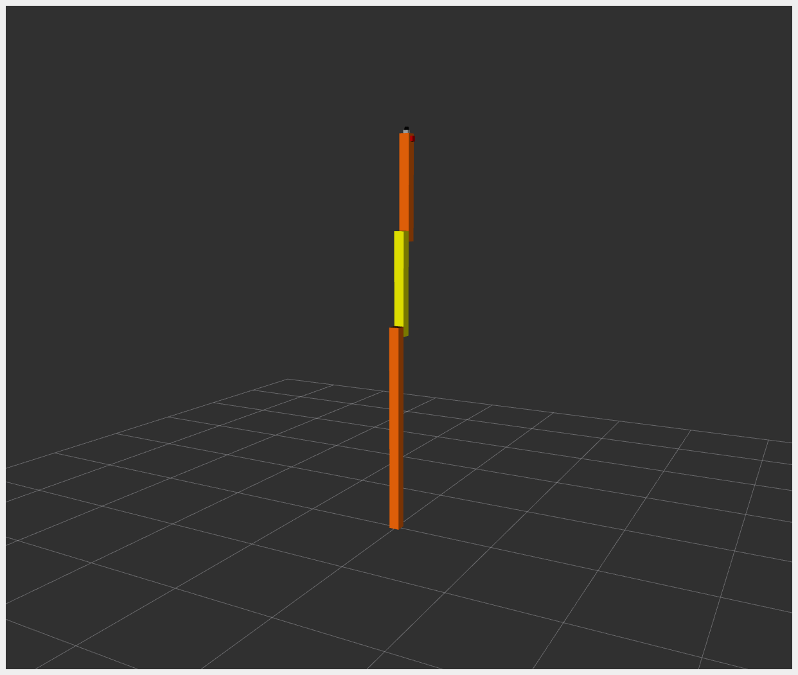

# Example 1: RRBot {#ros2_control_demos_example_1_userdoc}

_RRBot_, or "Revolute-Revolute Manipulator Robot", is a simple 3-linkage, 2-joint arm that we will use to demonstrate various features.
It is essentially a double inverted pendulum and demonstrates some fun control concepts within a simulator and was originally introduced for Gazebo tutorials.

> _RRBot_，或`旋转-进化机械手机器人`，是一种简单的 3 连杆、2 关节手臂，我们将使用它来演示各种功能。
> 它本质上是一个双倒立摆，在模拟器中演示了一些有趣的控制概念，最初是为 Gazebo 教程介绍的。

For _example_1_, the hardware interface plugin is implemented having only one interface.

> 对于 _example_1_，硬件接口插件实现时只有一个接口。

- The communication is done using proprietary API to communicate with the robot control box.
- Data for all joints is exchanged at once.
- Examples: KUKA RSI

The _RRBot_ URDF files can be found in the `description/urdf` folder.

## Tutorial steps

1.  (Optional) To check that _RRBot_ descriptions are working properly use following launch commands

> 1. (可选)要检查*RRBot*说明是否正常工作，请使用以下启动命令

```shell
ros2 launch ros2_control_demo_example_1 view_robot.launch.py
```

Now, we need to start `joint_state_publisher_gui` as well as `rviz2` to view the robot, each in their own terminals after sourcing our ROS 2 installation.

> 现在，我们需要启动`joint_state_publisher_gui`和`rviz2`来查看机器人，在采购我们的 ROS2 安装后，每个机器人都在自己的终端中。

```shell
source /opt/ros/${ROS_DISTRO}/setup.bash
ros2 run joint_state_publisher_gui joint_state_publisher_gui
```

The _RViz_ setup can be recreated following these steps:

- The robot models can be visualized using `RobotModel` display using `/robot_description` topic.
- Or you can simply open the configuration from `ros2_control_demo_description/rrbot/rviz` folder manually or directly by executing from another terminal

> - 或者，您可以简单地手动或直接从另一个终端执行从`ros2_control_demo_description/rrbot/rviz`文件夹打开配置

```shell
source /opt/ros/${ROS_DISTRO}/setup.bash
rviz2 -d src/ros2_control_demos/ros2_control_demo_description/rrbot/rviz/rrbot.rviz
```

Getting the following output in terminal is OK: `Warning: Invalid frame ID "odom" passed to canTransform argument target_frame - frame does not exist`. This happens because `joint_state_publisher_gui` node need some time to start.

> 在终端中获得以下输出是可以的：`警告：传递给canTransform参数target_frame的无效帧ID "odom" - 帧不存在`。发生这种情况是因为`joint_state_publisher_gui`节点需要一些时间才能启动。

The `joint_state_publisher_gui` provides a GUI to change the configuration for _RRbot_. It is immediately displayed in _RViz_.

> `joint_state_publisher_gui`提供了一个 gui 来更改 _RRbot_ 的配置。它立即显示在 _RViz_ 中。

{width="400px"}

Once it is working you can stop rviz using CTRL+C as the next launch file is starting RViz.

> 一旦它开始工作，您可以使用 CTRL+C 停止 rviz，因为下一个启动文件正在启动 rviz。

2.  To start _RRBot_ example open a terminal, source your ROS2-workspace and execute its launch file with

> 2. 要启动 _RRBot_ 示例，请打开一个终端，获取 ROS2 工作空间的源代码，并使用执行其启动文件

```shell
ros2 launch ros2_control_demo_example_1 rrbot.launch.py
```

The launch file loads and starts the robot hardware and controllers. Open _RViz_ in a new terminal as described above.

> 启动文件加载并启动机器人硬件和控制器。如上所述，在新终端中打开 _RViz_。

In starting terminal you will see a lot of output from the hardware implementation showing its internal states. This is only of exemplary purposes and should be avoided as much as possible in a hardware interface implementation.

> 在启动终端时，您将看到硬件实现的大量输出，显示其内部状态。这只是示例性的目的，并且在硬件接口实现中应该尽可能避免。

If you can see two orange and one yellow rectangle in _RViz_ everything has started properly. Still, to be sure, let\'s introspect the control system before moving _RRBot_.

> 如果你能在 _RViz_ 中看到两个橙色和一个黄色的矩形，一切都开始正常了。不过，可以肯定的是，在移动 _RRBot_ 之前，让我们反思一下控制系统。

3.  Check if the hardware interface loaded properly, by opening another terminal and executing

> 3. 通过打开另一个终端并执行，检查硬件接口是否正确加载

```shell
ros2 control list_hardware_interfaces
```

If everything started nominally, you should see the output

```shell
command interfaces
        joint1/position [available] [claimed]
        joint2/position [available] [claimed]
state interfaces
        joint1/position
        joint2/position
```

Marker `[claimed]` by command interfaces means that a controller has access to command _RRBot_.

> 命令接口的标记`[声称]`表示控制器可以访问命令 _RRBot_。

4. Check if controllers are running by

```shell
ros2 control list_controllers
```

You will see the two controllers in active state

```shell
joint_state_broadcaster[joint_state_broadcaster/JointStateBroadcaster] active
forward_position_controller[forward_command_controller/ForwardCommandController] active
```

5. If you get output from above you can send commands to _Forward Command Controller_, either:

> 5. 如果您从上面获得输出，您可以向 _Forward Command Controller_ 发送命令，或者：

a. Manually using ROS 2 CLI interface:

```shell
ros2 topic pub /forward_position_controller/commands std_msgs/msg/Float64MultiArray "data:
    - 0.5
    - 0.5"
```

b. Or you can start a demo node which sends two goals every 5 seconds in a loop:

```shell
ros2 launch ros2_control_demo_example_1 test_forward_position_controller.launch.py
```

You should now see orange and yellow blocks moving in _RViz_. Also, you should see changing states in the terminal where launch file is started, e.g.

> 您现在应该看到橙色和黄色块在 _RViz_ 中移动。此外，您应该在启动文件的终端中看到状态的变化，例如。

```shell
[RRBotSystemPositionOnlyHardware]: Got command 0.50000 for joint 0!
[RRBotSystemPositionOnlyHardware]: Got command 0.50000 for joint 1!
```

If you echo the `/joint_states` or `/dynamic_joint_states` topics you should now get similar values, namely the simulated states of the robot

> 如果查看 '/joint_states' 或 '/dynamic_joint_states' 主题，您现在应该会得到类似的值，即机器人的模拟状态

```shell
ros2 topic echo /joint_states
ros2 topic echo /dynamic_joint_states
```

6. Let\'s switch to a different controller, the `Joint Trajectory Controller`. Load the controller manually by

> 6. 让我们切换到另一个控制器，即`关节轨迹控制器`。通过手动加载控制器

```shell
ros2 control load_controller joint_trajectory_position_controller
```

what should return `Successfully loaded controller joint_trajectory_position_controller`. Check the status with

> 应该返回什么`Successfully loaded controller joint_trajectory_position_controller`。使用检查状态

```shell
ros2 control list_controllers
```

what shows you that the controller is loaded but unconfigured.

```shell
joint_state_broadcaster[joint_state_broadcaster/JointStateBroadcaster] active
forward_position_controller[forward_command_controller/ForwardCommandController] active
joint_trajectory_position_controller[joint_trajectory_controller/JointTrajectoryController] unconfigured
```

Configure the controller by setting it `inactive` by

```shell
ros2 control set_controller_state joint_trajectory_position_controller inactive
```

what should give `Successfully configured joint_trajectory_position_controller`.

> 应该给出什么`Successfully configured joint_trajectory_position_controller`。

The parameters are already set in [rrbot_controllers.yaml](https://github.com/ros-controls/ros2_control_demos/tree/%7BREPOS_FILE_BRANCH%7D/example_1/bringup/config/rrbot_controllers.yaml) but the controller was not loaded from the [launch file rrbot.launch.py](https://github.com/ros-controls/ros2_control_demos/tree/%7BREPOS_FILE_BRANCH%7D/example_1/bringup/launch/rrbot.launch.py) before.

> 参数已在[rrbot_controllers.yaml]中设置，但控制器未从[launch file rrbot.slaunch.py]加载之前

As an alternative, you can load the controller directly in `inactive`-state by means of the option for `load_controller` with

> 作为一种选择，您可以通过`load_controller`的选项直接在`inactive`状态下加载控制器

```shell
ros2 control load_controller joint_trajectory_position_controller --set-state inactive
```

You should get the result `Successfully loaded controller joint_trajectory_position_controller into state inactive`.

> 您应该得到结果`成功将控制器 joint_trajectory_position_controller 加载到非活动状态`。

See if it loaded properly with

```shell
ros2 control list_controllers
```

what should now return

```shell
joint_state_broadcaster[joint_state_broadcaster/JointStateBroadcaster] active
forward_position_controller[forward_command_controller/ForwardCommandController] active
joint_trajectory_position_controller[joint_trajectory_controller/JointTrajectoryController] inactive
```

Note that the controller is loaded but still `inactive`. Now you can switch the controller by

> 请注意，控制器已加载，但仍处于`非活动`状态。现在您可以通过切换控制器

```shell
ros2 control set_controller_state forward_position_controller inactive
ros2 control set_controller_state joint_trajectory_position_controller active
```

or simply via this one-line command

```shell
ros2 control switch_controllers --activate joint_trajectory_position_controller --deactivate forward_position_controller
```

Again, check via

```shell
ros2 control list_controllers
```

what should now return

```shell
joint_state_broadcaster[joint_state_broadcaster/JointStateBroadcaster] active
forward_position_controller[forward_command_controller/ForwardCommandController] inactive
joint_trajectory_position_controller[joint_trajectory_controller/JointTrajectoryController] active
```

Send a command to the controller using demo node, which sends four goals every 6 seconds in a loop with

> 使用 demo 节点向控制器发送命令，该节点在循环中每 6 秒发送四个目标

```shell
ros2 launch ros2_control_demo_example_1 test_joint_trajectory_controller.launch.py
```

You can adjust the goals in [rrbot_joint_trajectory_publisher](https://github.com/ros-controls/ros2_control_demos/tree/%7BREPOS_FILE_BRANCH%7D/example_1/bringup/config/rrbot_joint_trajectory_publisher.yaml).

> 您可以在[rrbot_joint_trajectory_publisher]中调整目标.

## Files used for this demos

- Launch file: [rrbot.launch.py](https://github.com/ros-controls/ros2_control_demos/tree/%7BREPOS_FILE_BRANCH%7D/example_1/bringup/launch/rrbot.launch.py)
- Controllers yaml: [rrbot_controllers.yaml](https://github.com/ros-controls/ros2_control_demos/tree/%7BREPOS_FILE_BRANCH%7D/example_1/bringup/config/rrbot_controllers.yaml)
- URDF file: [rrbot.urdf.xacro](https://github.com/ros-controls/ros2_control_demos/tree/%7BREPOS_FILE_BRANCH%7D/example_1/description/urdf/rrbot.urdf.xacro)
- Description: [rrbot_description.urdf.xacro](https://github.com/ros-controls/ros2_control_demos/tree/%7BREPOS_FILE_BRANCH%7D/ros2_control_demo_description/rrbot/urdf/rrbot_description.urdf.xacro)
- `ros2_control` tag: [rrbot.ros2_control.xacro](https://github.com/ros-controls/ros2_control_demos/tree/%7BREPOS_FILE_BRANCH%7D/example_1/description/ros2_control/rrbot.ros2_control.xacro)
- RViz configuration: [rrbot.rviz](https://github.com/ros-controls/ros2_control_demos/tree/%7BREPOS_FILE_BRANCH%7D/ros2_control_demo_description/rrbot/rviz/rrbot.rviz)
- Test nodes goals configuration:
  - [rrbot_forward_position_publisher](https://github.com/ros-controls/ros2_control_demos/tree/%7BREPOS_FILE_BRANCH%7D/example_1/bringup/config/rrbot_forward_position_publisher.yaml)
  - [rrbot_joint_trajectory_publisher](https://github.com/ros-controls/ros2_control_demos/tree/%7BREPOS_FILE_BRANCH%7D/example_1/bringup/config/rrbot_joint_trajectory_publisher.yaml)
- Hardware interface plugin: [rrbot.cpp](https://github.com/ros-controls/ros2_control_demos/tree/%7BREPOS_FILE_BRANCH%7D/example_1/hardware/rrbot.cpp)

## Controllers from this demo

- `Joint State Broadcaster` ([ros2_controllers repository](https://github.com/ros-controls/ros2_controllers/tree/%7BREPOS_FILE_BRANCH%7D/joint_state_broadcaster)): [doc](https://control.ros.org/%7BREPOS_FILE_BRANCH%7D/doc/ros2_controllers/joint_state_broadcaster/doc/userdoc.html)
- `Forward Command Controller` ([ros2_controllers repository](https://github.com/ros-controls/ros2_controllers/tree/%7BREPOS_FILE_BRANCH%7D/forward_command_controller)): [doc](https://control.ros.org/%7BREPOS_FILE_BRANCH%7D/doc/ros2_controllers/forward_command_controller/doc/userdoc.html)
- `Joint Trajectory Controller` ([ros2_controllers repository](https://github.com/ros-controls/ros2_controllers/tree/%7BREPOS_FILE_BRANCH%7D/joint_trajectory_controller)): [doc](https://control.ros.org/%7BREPOS_FILE_BRANCH%7D/doc/ros2_controllers/joint_trajectory_controller/doc/userdoc.html)
