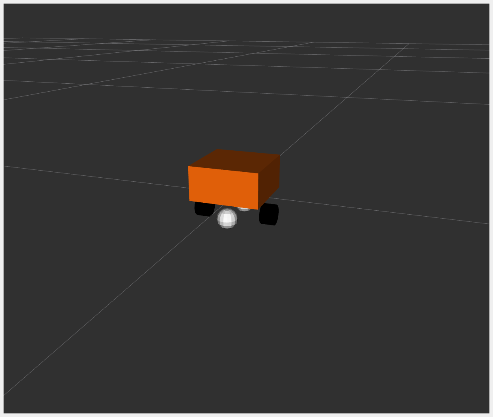

# DiffBot {#ros2_control_demos_example_2_userdoc}

_DiffBot_, or 'Differential Mobile Robot', is a simple mobile base with differential drive. The robot is basically a box moving according to differential drive kinematics.

> _DiffBot_，或称“差速移动机器人”，是一种带有差速驱动的简单移动底座。机器人基本上是一个根据差速驱动运动学运动的盒子。

For _example_2_, the hardware interface plugin is implemented having only one interface.

> 例如，硬件接口插件实现为只有一个接口。

- The communication is done using proprietary API to communicate with the robot control box.
- Data for all joints is exchanged at once.

The _DiffBot_ URDF files can be found in `description/urdf` folder.

## Tutorial steps

1.  To check that _DiffBot_ description is working properly use following launch commands

> 1. 要检查 _DiffBot_ 描述是否正常工作，请使用以下启动命令

    ``` shell
    ros2 launch ros2_control_demo_example_2 view_robot.launch.py
    ```

    Getting the following output in terminal is OK: `Warning: Invalid frame ID "odom" passed to canTransform argument target_frame - frame does not exist`. This happens because `joint_state_publisher_gui` node need some time to start.

    {width="400px"}

2.  To start _DiffBot_ example open a terminal, source your ROS2-workspace and execute its launch file with

> 2. 要启动 _DiffBot_ 示例，请打开一个终端，获取 ROS2 工作空间的源代码，并使用执行其启动文件

    ``` shell
    ros2 launch ros2_control_demo_example_2 diffbot.launch.py
    ```

    The launch file loads and starts the robot hardware, controllers and opens *RViz*. In the starting terminal you will see a lot of output from the hardware implementation showing its internal states. This excessive printing is only added for demonstration. In general, printing to the terminal should be avoided as much as possible in a hardware interface implementation.

    > 启动文件加载并启动机器人硬件，控制器并打开 *rviz*。在起始终端中，您会看到硬件实现显示其内部状态的大量输出。这种过多的印刷仅添加用于演示。通常，在硬件接口实现中应尽可能避免打印到终端的打印。

    If you can see an orange box in *RViz* everything has started properly. Still, to be sure, let\'s introspect the control system before moving *DiffBot*.

3.  Check if the hardware interface loaded properly, by opening another terminal and executing

> 3. 通过打开另一个终端并执行，检查硬件接口是否正确加载

    ``` shell
    ros2 control list_hardware_interfaces
    ```

    You should get

    ``` shell
    command interfaces
          left_wheel_joint/velocity [available] [claimed]
          right_wheel_joint/velocity [available] [claimed]
    state interfaces
          left_wheel_joint/position
          left_wheel_joint/velocity
          right_wheel_joint/position
          right_wheel_joint/velocity
    ```

    The `[claimed]` marker on command interfaces means that a controller has access to command *DiffBot*.

    Furthermore, we can see that the command interface is of type `velocity`, which is typical for a differential drive robot.

4.  Check if controllers are running

    ```shell
    ros2 control list_controllers
    ```

    You should get

    ```shell
    diffbot_base_controller[diff_drive_controller/DiffDriveController] active
    joint_state_broadcaster[joint_state_broadcaster/JointStateBroadcaster] active
    ```

5.  If everything is fine, now you can send a command to _Diff Drive Controller_ using ROS 2 CLI interface:

> 5. 如果一切正常，现在您可以使用 ROS 2 CLI 接口向*Diff Drive Controller*发送命令：

    ``` shell
    ros2 topic pub --rate 30 /diffbot_base_controller/cmd_vel geometry_msgs/msg/TwistStamped "
    twist:
      linear:
        x: 0.7
        y: 0.0
        z: 0.0
      angular:
        x: 0.0
        y: 0.0
        z: 1.0"
    ```

    You should now see an orange box circling in *RViz*. Also, you should see changing states in the terminal where launch file is started.

    ``` shell
    [DiffBotSystemHardware]: Got command 43.33333 for 'left_wheel_joint'!
    [DiffBotSystemHardware]: Got command 50.00000 for 'right_wheel_joint'!
    ```

6.  Let\'s introspect the ros2_control hardware component. Calling

    ```shell
    ros2 control list_hardware_components
    ```

    should give you

    ```shell
    Hardware Component 1
            name: DiffBot
            type: system
            plugin name: ros2_control_demo_example_2/DiffBotSystemHardware
            state: id=3 label=active
            command interfaces
                    left_wheel_joint/velocity [available] [claimed]
                    right_wheel_joint/velocity [available] [claimed]
    ```

    This shows that the custom hardware interface plugin is loaded and running. If you work on a real robot and don\'t have a simulator running, it is often faster to use the `mock_components/GenericSystem` hardware component instead of writing a custom one. Stop the launch file and start it again with an additional parameter

    > 这表明自定义硬件接口插件已加载并运行。如果您在真正的机器人上工作并且没有模拟器运行，则使用`mock_components/genericSystem`硬件组件而不是编写自定义的`Mock_Components/GenericSystem`硬件组件''通常更快。停止启动文件并使用附加参数重新启动

    ```shell
    ros2 launch ros2_control_demo_example_2 diffbot.launch.py use_mock_hardware:=True
    ```

    Calling

    ```shell
    ros2 control list_hardware_components
    ```

    now should give you

    ```shell
    Hardware Component 1
        name: DiffBot
        type: system
        plugin name: mock_components/GenericSystem
        state: id=3 label=active
        command interfaces
                left_wheel_joint/velocity [available] [claimed]
                right_wheel_joint/velocity [available] [claimed]
    ```

    You see that a different plugin was loaded. Having a look into the [diffbot.ros2_control.xacro](https://github.com/ros-controls/ros2_control_demos/tree/%7BREPOS_FILE_BRANCH%7D/example_2/description/ros2_control/diffbot.ros2_control.xacro), one can find the instructions to load this plugin together with the parameter `calculate_dynamics`.

    > 您会发现加载了其他插件。查看[diffbot.2_control.xacro]将此插件与参数`calculate_dynamics“加载的说明”。

    ```xml
    <hardware>
      <plugin>mock_components/GenericSystem</plugin>
      <param name="calculate_dynamics">true</param>
    </hardware>
    ```

    This enables the integration of the velocity commands to the position state interface, which can be checked by means of `ros2 topic echo /joint_states`: The position values are increasing over time if the robot is moving. You now can test the setup with the commands from above, it should work identically as the custom hardware component plugin.

    > 这使速度命令集成到位置状态接口，可以通过`ros2 topic echo /joint_states`进行检查：如果机器人移动，则位置值随着时间的推移而增加。现在，您可以使用上面的命令测试设置，它应该与自定义硬件组件插件相同工作。

    More information on mock_components can be found in the `ros2_control documentation <mock_components_userdoc>`{.interpreted-text role="ref"}.

## Files used for this demos

- Launch file: [diffbot.launch.py](https://github.com/ros-controls/ros2_control_demos/tree/%7BREPOS_FILE_BRANCH%7D/example_2/bringup/launch/diffbot.launch.py)
- Controllers yaml: [diffbot_controllers.yaml](https://github.com/ros-controls/ros2_control_demos/tree/%7BREPOS_FILE_BRANCH%7D/example_2/bringup/config/diffbot_controllers.yaml)
- URDF file: [diffbot.urdf.xacro](https://github.com/ros-controls/ros2_control_demos/tree/%7BREPOS_FILE_BRANCH%7D/example_2/description/urdf/diffbot.urdf.xacro)

  - Description: [diffbot_description.urdf.xacro](https://github.com/ros-controls/ros2_control_demos/tree/%7BREPOS_FILE_BRANCH%7D/ros2_control_demo_description/diffbot/urdf/diffbot_description.urdf.xacro)
  - `ros2_control` tag: [diffbot.ros2_control.xacro](https://github.com/ros-controls/ros2_control_demos/tree/%7BREPOS_FILE_BRANCH%7D/example_2/description/ros2_control/diffbot.ros2_control.xacro)

- RViz configuration: [diffbot.rviz](https://github.com/ros-controls/ros2_control_demos/tree/%7BREPOS_FILE_BRANCH%7D/ros2_control_demo_description/diffbot/rviz/diffbot.rviz)
- Hardware interface plugin: [diffbot_system.cpp](https://github.com/ros-controls/ros2_control_demos/tree/%7BREPOS_FILE_BRANCH%7D/example_2/hardware/diffbot_system.cpp)

## Controllers from this demo

- `Joint State Broadcaster` ([ros2_controllers repository](https://github.com/ros-controls/ros2_controllers/tree/%7BREPOS_FILE_BRANCH%7D/joint_state_broadcaster)): [doc](https://control.ros.org/%7BREPOS_FILE_BRANCH%7D/doc/ros2_controllers/joint_state_broadcaster/doc/userdoc.html)
