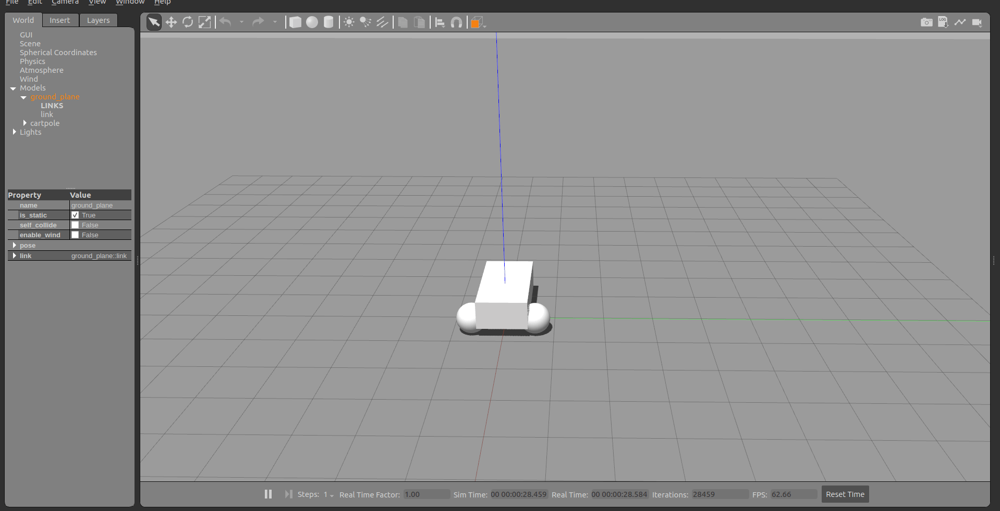
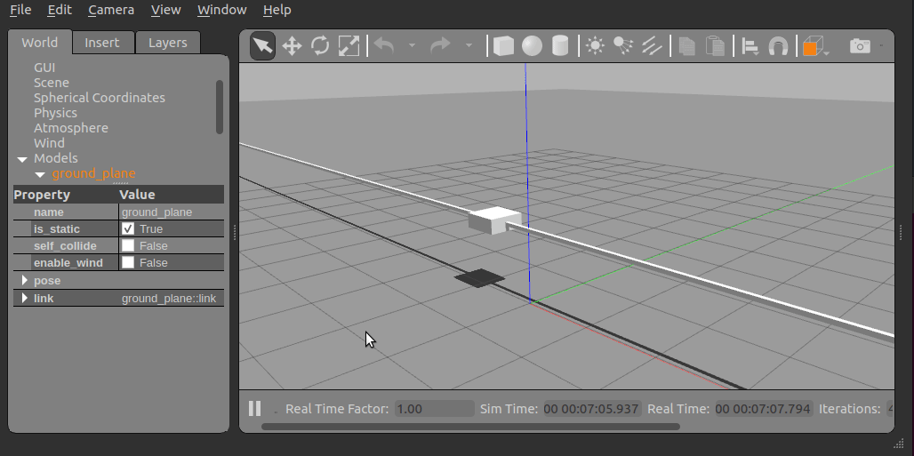
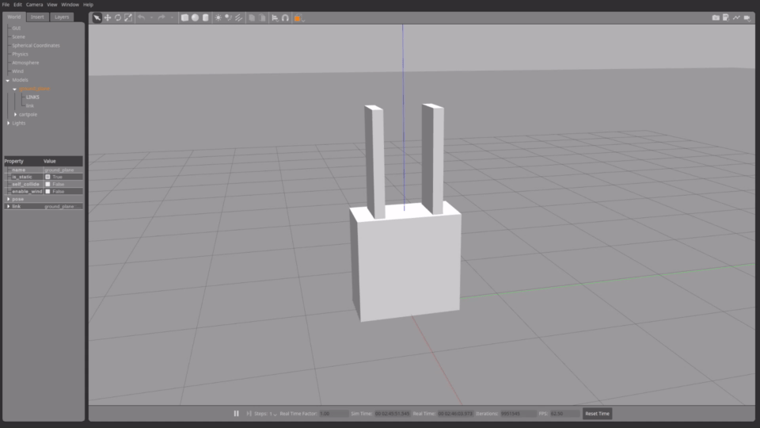

# gazebo_ros2_control

This is a ROS 2 package for integrating the _ros2_control_ controller architecture with the [Gazebo Classic](https://classic.gazebosim.org/) simulator.

> 这是一个 ROS 2 软件包，用于将 _ROS2_Control_ 控制器架构与[Gazebo Classic](https://classic.gazebosim.org/)模拟器集成。

Gazebo Classic goes end-of-life in January of 2025. We strongly recommend all users migrate from Gazebo Classic (numbered releases) to modern Gazebo (formerly known as Ignition 3, lettered releases) before January 2025.

> Gazebo Classic 将于 2025 年 1 月终止。我们强烈建议所有用户从 2025 年 1 月之前从 Gazebo Classic(编号发行版)迁移到 Modern Gazebo(以前称为 IGNITION 3，以前称为 Ignition 3，字母发行)。

Furthermore, Gazebo Classic is not released to Ubuntu Noble. As a consequence, gazebo_ros2_control won\'t be released for Jazzy and Rolling anymore.

> 此外，Gazebo Classic 尚未发布给 Ubuntu Noble。结果，Gazebo_Ros2_Control 将不再发布爵士乐和滚动。

This package provides a Gazebo plugin which instantiates a _ros2_control_ controller manager and connects it to a Gazebo model.

> 该软件包提供了一个 GAZEBO 插件，该插件可以实例化 _ROS2_CONTROL_ 控制器管理器并将其连接到 GAZEBO 模型。




## Usage

### Modifying or building your own

```shell
cd Docker
docker build -t gazebo_ros2_control .
```

### To run the demo

1.  Using Docker

Docker allows us to run the demo without GUI if we don\'t configure it properly. The following command runs the demo without GUI:

> 如果我们无法正确配置，Docker 允许我们在没有 GUI 的情况下运行演示。以下命令在没有 GUI 的情况下运行演示：

```shell
docker run -it --rm --name gazebo_ros2_control_demo --net host gazebo_ros2_control ros2 launch gazebo_ros2_control_demos cart_example_position.launch.py gui:=false

# ros2 launch gazebo_ros2_control_demos cart_example_position.launch.py gui:=false
```

The in your local machine you can run the Gazebo Classic client:

```shell
gzclient
```

2.  Using Rocker

To run the demo with GUI we are going to use [rocker](https://github.com/osrf/rocker/) which is a tool to run docker images with customized local support injected for things like nvidia support. And user id specific files for cleaner mounting file permissions. You can install this tool with the following [instructions](https://github.com/osrf/rocker/#installation).

> 要使用 GUI 运行演示，我们将使用[Rocker](https：//github.com/osrf/rocker/)，这是运行 Docker Image 的工具，并使用自定义的本地支持注入了 Nvidia Support 等物品。和用户 ID 特定文件，用于清洁程序安装文件权限。您可以使用以下[指令](https://github.com/osrf/rocker/#installation)安装此工具。

The following command will launch Gazebo Classic:

```shell
rocker --x11 --nvidia --name gazebo_ros2_control_demo gazebo_ros2_control:latest
```

The following commands allow to move the cart in the rail:

```shell
docker exec -it gazebo_ros2_control_demo bash
source /home/ros2_ws/install/setup.bash
ros2 run gazebo_ros2_control_demos example_position
```

## Add ros2_control tag to a URDF

### Simple setup

To use _ros2_control_ with your robot, you need to add some additional elements to your URDF. You should include the tag `<ros2_control>` to access and control the robot interfaces. We should include

> 要与机器人一起使用 _ROS2_CONTROL_，您需要在 URDF 中添加一些其他元素。您应该包括标签`<ros2_control>`以访问和控制机器人接口。我们应该包括

- a specific `<plugin>` for our robot
- `<joint>` tag including the robot controllers: commands and states.

```xml
<ros2_control name="GazeboSystem" type="system">
  <hardware>
    <plugin>gazebo_ros2_control/GazeboSystem</plugin>
  </hardware>
  <joint name="slider_to_cart">
    <command_interface name="effort">
      <param name="min">-1000</param>
      <param name="max">1000</param>
    </command_interface>
    <state_interface name="position">
      <param name="initial_value">1.0</param>
    </state_interface>
    <state_interface name="velocity"/>
    <state_interface name="effort"/>
  </joint>
</ros2_control>
```

### Using mimic joints in simulation

To use `mimic` joints in _gazebo_ros2_control_ you should define its parameters to your URDF. We should include:

> 要在 _gazebo_ros2_control_ 中使用`mimic`关节，您应该将其参数定义为 urdf。我们应该包括：

- `<mimic>` tag to the mimicked joint [detailed manual](https://wiki.ros.org/urdf/XML/joint)
- `mimic` and `multiplier` parameters to joint definition in `<ros2_control>` tag

```xml
<joint name="left_finger_joint" type="prismatic">
  <mimic joint="right_finger_joint"/>
  <axis xyz="0 1 0"/>
  <origin xyz="0.0 0.48 1" rpy="0.0 0.0 3.1415926535"/>
  <parent link="base"/>
  <child link="finger_left"/>
  <limit effort="1000.0" lower="0" upper="0.38" velocity="10"/>
</joint>
```

```xml
<joint name="left_finger_joint">
  <param name="mimic">right_finger_joint</param>
  <param name="multiplier">1</param>
  <command_interface name="position"/>
  <state_interface name="position"/>
  <state_interface name="velocity"/>
  <state_interface name="effort"/>
</joint>
```

### Using PID control joints

To use PID control joints in gazebo_ros2_control, you should define their parameters inside the `<joint>` tag within the `<ros2_control>` tag. These PID joints can be controlled either in position or velocity.

> 要在 gazebo_ros2_control 中使用 PID 控制关节，您应该在`<ros2_control>`标签内的`<joint>`标签内定义它们的参数。这些 PID 关节可以控制位置或速度。

- To control a joint with velocity PID, simply set its `command_interface` to `velocity_PID`.
- To control a joint with position PID, set its `command_interface` to `position_PID`.

> - 要使用速度 PID 控制关节，只需将其 `command_interface` 设置为 `velocity_PID`。
> - 要使用位置 PID 控制关节，只需将其 `command_interface` 设置为 `position_PID`。

You cannot have both command interfaces set to position and position_PID for the same joint. The same restriction applies to velocity (and velocity_PID).

> 您不能将两个命令接口设置为位置和相同关节的位置 position_PID。同样的限制也适用于速度(和 velocity_PID)。

To create a system with one joint that can be controlled using both position_PID and velocity_PID, follow this example:

> 要创建一个可以使用 position_pid 和 velocity_pid 控制一个关节的系统，请按照以下示例：

```xml
<ros2_control name="GazeboSystem" type="system">
   <hardware>
     <plugin>gazebo_ros2_control/GazeboSystem</plugin>
   </hardware>
   <joint name="slider_to_cart">
     <param name="pos_kp">10</param>
     <param name="pos_ki">1</param>
     <param name="pos_kd">2</param>
     <param name="pos_max_integral_error">10000</param>

     <param name="vel_kp">10</param>
     <param name="vel_ki">5</param>
     <param name="vel_kd">2</param>
     <param name="vel_max_integral_error">10000</param>

     <command_interface name="position_PID"/>
     <command_interface name="velocity_PID"/>

     <state_interface name="position">
       <param name="initial_value">1.0</param>
     </state_interface>
     <state_interface name="velocity"/>
     <state_interface name="effort"/>
   </joint>
 </ros2_control>
```

Where the parameters are as follows:

- `pos_kp`: Proportional gain
- `pos_ki`: Integral gain
- `pos_kd`: Derivative gain
- `pos_max_integral_error`: Maximum summation of the error

The same definitions apply to the `vel_*` parameters.

## Add the gazebo_ros2_control plugin

In addition to the _ros2_control_ tags, a Gazebo plugin needs to be added to your URDF that actually parses the _ros2_control_ tags and loads the appropriate hardware interfaces and controller manager. By default the _gazebo_ros2_control_ plugin is very simple, though it is also extensible via an additional plugin architecture to allow power users to create their own custom robot hardware interfaces between _ros2_control_ and Gazebo Classic.

> 除了 _ROS2_Control_ 标签外，还需要将 GAZEBO 插件添加到您的 urdf 中，该插件实际上解析了 _ROS2_Control_ 标签并加载适当的硬件接口和控制器管理器。默认情况下，_GAZEBO_ROS2_CONTROL_ 插件非常简单，尽管它也可以通过附加的插件体系结构扩展，以允许 Power 用户在 _ROS2_Control_ 和 Gazebo Classic 之间创建自己的自定义机器人硬件接口。

```xml
<gazebo>
  <plugin filename="libgazebo_ros2_control.so" name="gazebo_ros2_control">
    <robot_param>robot_description</robot_param>
    <robot_param_node>robot_state_publisher</robot_param_node>
    <parameters>$(find gazebo_ros2_control_demos)/config/cart_controller.yaml</parameters>
  </plugin>
</gazebo>
```

The _gazebo_ros2_control_ `<plugin>` tag also has the following optional child elements:

- `<robot_param>`: The location of the `robot_description` (URDF) on the parameter server, defaults to `robot_description`
- `<robot_param_node>`: Name of the node where the `robot_param` is located, defaults to `robot_state_publisher`
- `<parameters>`: YAML file with the configuration of the controllers

> _gazebo_ros2_control_ `<plugin>` tag 还具有以下可选的子元素：

> - `<robot_param>`：参数服务器上`robot_description` (URDF) 的位置，默认为`robot_description`
> - `<robot_param_node>`：`robot_param`所在节点的名称，默认为`robot_state_publisher`
> - `<parameters>`：包含控制器配置的 YAML 文件

### Default gazebo_ros2_control Behavior

By default, without a `<plugin>` tag, _gazebo_ros2_control_ will attempt to get all of the information it needs to interface with a ros2_control-based controller out of the URDF. This is sufficient for most cases, and good for at least getting started.

> 默认情况下，如果没有 `<plugin>` tag，_gazebo_ros2_control_ 将尝试从 urdf 中获取与基于 ROS2_Control 的控制器接口所需的所有信息。这在大多数情况下就足够了，至少可以入门。

The default behavior provides the following ros2_control interfaces:

- hardware_interface::JointStateInterface
- hardware_interface::EffortJointInterface
- hardware_interface::VelocityJointInterface

### Advanced: custom gazebo_ros2_control Simulation Plugins

The _gazebo_ros2_control_ Gazebo plugin also provides a pluginlib-based interface to implement custom interfaces between Gazebo Classic and _ros2_control_ for simulating more complex mechanisms (nonlinear springs, linkages, etc).

> _GAZEBO_ROS2_CONTROL_ GEAZEBO 插件还提供了基于插件的接口，以实现 Gazebo Classic 和 _ROS2_Control_ 之间的自定义接口，以模拟更复杂的机制(非线性弹簧，链接，链接，等)。

These plugins must inherit `gazebo_ros2_control::GazeboSystemInterface` which implements a simulated _ros2_control_ `hardware_interface::SystemInterface`. SystemInterface provides API-level access to read and command joint properties.

> 这些插件必须继承 `gazebo_ros2_control::GazeboSystemInterface`，该插件实现了模拟 _ROS2_CONTROL_ `hardware_interface::SystemInterface`。SystemInterface 提供了读取和命令联合属性的 API 级访问。

The respective GazeboSystemInterface sub-class is specified in a URDF model and is loaded when the robot model is loaded. For example, the following XML will load the default plugin:

> 相应的 GazeboSystemInterface 子类在 URDF 模型中指定，并在加载机器人模型时加载。例如，以下 XML 将加载默认插件：

```xml
<ros2_control name="GazeboSystem" type="system">
  <hardware>
    <plugin>gazebo_ros2_control/GazeboSystem</plugin>
  </hardware>
  ...
<ros2_control>
<gazebo>
  <plugin name="gazebo_ros2_control" filename="libgazebo_ros2_control.so">
    ...
  </plugin>
</gazebo>
```

### Set up controllers

Use the tag `<parameters>` inside `<plugin>` to set the YAML file with the controller configuration.

> 使用`<plugin>`内的标签`<parameters>`来设置带有控制器配置的 YAML 文件。

```xml
<gazebo>
  <plugin name="gazebo_ros2_control" filename="libgazebo_ros2_control.so">
    <parameters>$(find gazebo_ros2_control_demos)/config/cart_controller.yaml</parameters>
  </plugin>
<gazebo>
```

The following is a basic configuration of the controllers:

- `joint_state_broadcaster`: This controller publishes the state of all resources registered to a `hardware_interface::StateInterface` to a topic of type `sensor_msgs/msg/JointState`.
- `joint_trajectory_controller`: This controller creates an action called `/joint_trajectory_controller/follow_joint_trajectory` of type `control_msgs::action::FollowJointTrajectory`.

- `joint_state_broadcaster`：此控制器将注册到 `hardware_interface::StateInterface` 的所有资源的状态发布到类型为 `sensor_msgs/msg/JointState` 的主题。
- `joint_trajectory_controller`：此控制器创建一个名为 `/joint_trajectory_controller/follow_joint_trajectory` 的操作，其类型为 `control_msgs::action::FollowJointTrajectory`。

::: {.literalinclude language="yaml"}
../gazebo_ros2_control_demos/config/cart_controller.yaml
:::

## gazebo_ros2_control_demos

This package contains the contents for testing gazebo_ros2_control. It is running Gazebo Classic and some other ROS 2 nodes.

> 该软件包包含用于测试 Gazebo_ros2_control 的内容。它正在运行 Gazebo Classic 和其他一些 ROS 2 节点。

There are some examples in the _Gazebo_ros2_control_demos_ package.

### Cart on rail

These examples allow to launch a cart in a 30 meter rail.



You can run some of the configuration running the following commands:

```shell
ros2 launch gazebo_ros2_control_demos cart_example_position.launch.py
ros2 launch gazebo_ros2_control_demos cart_example_velocity.launch.py
ros2 launch gazebo_ros2_control_demos cart_example_effort.launch.py
```

When the Gazebo world is launched you can run some of the following commands to move the cart.

> 当启动 GAZEBO 世界时，您可以运行以下一些命令来移动购物车。

```shell
ros2 run gazebo_ros2_control_demos example_position
ros2 run gazebo_ros2_control_demos example_position_pid
ros2 run gazebo_ros2_control_demos example_velocity
ros2 run gazebo_ros2_control_demos example_effort
```

### Mobile robots

You can run some of the mobile robots running the following commands:

```shell
ros2 launch gazebo_ros2_control_demos diff_drive.launch.py
ros2 launch gazebo_ros2_control_demos tricycle_drive.launch.py
```

When the Gazebo world is launched you can run some of the following commands to move the robots.

> 当启动 GAZEBO 世界时，您可以运行以下一些命令来移动机器人。

```shell
ros2 run gazebo_ros2_control_demos example_diff_drive
ros2 run gazebo_ros2_control_demos example_tricycle_drive
```

### Gripper

The following example shows a parallel gripper with a mimic joint:

```shell
ros2 launch gazebo_ros2_control_demos gripper_mimic_joint_example_position.launch.py
```



```shell
ros2 launch gazebo_ros2_control_demos gripper_mimic_joint_example.launch.py
```

Send example commands:

```shell
ros2 run gazebo_ros2_control_demos example_gripper
```

### Pendulum with passive joints

The following example shows a cart with a pendulum arm. This uses the effort command interface for the cart\'s degree of freedom on the rail, and the physics of the passive joint of the pendulum is solved correctly.

> 以下示例显示了带摆臂的购物车。这使用了轨道上的自由度的努力命令界面，并且可以正确解决摆锤的物理。

```shell
ros2 launch gazebo_ros2_control_demos pendulum_example_effort.launch.py
ros2 run gazebo_ros2_control_demos example_effort
```

::: {.note}
::: {.title}
Note
:::

If the position command interface is used instead, the motion of the pendulum is not calculated correctly and does not move at all, see this [PR](https://github.com/ros-controls/gazebo_ros2_control/issues/240). This also holds true if a mimicked joint with position interface is used. To demonstrate this, run

> 如果使用位置命令接口，则不会正确计算摆的运动，并且根本不移动，请参见此[pr](https://github.com/ros-controls/gazebo_ros2_control/issues/240)。如果使用模仿带有位置界面的接头，这也是正确的。为了证明这一点，请运行

```shell
ros2 launch gazebo_ros2_control_demos pendulum_example_position.launch.py
ros2 run gazebo_ros2_control_demos example_position
```

:::

### PID control joints

The following examples shows a vertical cart control by a PID joint using position and velocity cmd.

> 以下示例显示了使用位置和速度 CMD 通过 PID 接头控制的垂直推车控制。

```shell
ros2 launch gazebo_ros2_control_demos vertical_cart_example_position_pid.launch.py
ros2 launch gazebo_ros2_control_demos vertical_cart_example_velocity_pid.launch.py
```

```shell
ros2 run gazebo_ros2_control_demos example_position_pid
ros2 run gazebo_ros2_control_demos example_velocity
```
