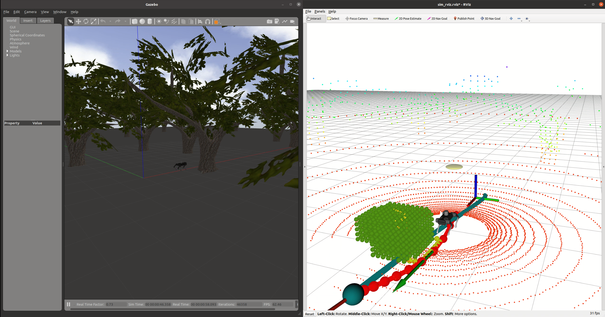

# Overview

This repository implements local obstacle avoidance and navigation tasks for quadruped robots based on traditional QP controllers and Ego-planner.



# Install

```bash
sudo apt install libyaml-cpp-dev
sudo apt install libeigen3-dev
sudo apt install liblcm-dev
sudo apt install libglm-dev
sudo apt-get install libarmadillo-dev

sudo apt-get install ros-noetic-controller-interface  ros-noetic-gazebo-ros-control ros-noetic-joint-state-controller ros-noetic-effort-controllers ros-noetic-joint-trajectory-controller
```

# Build

```bash
git clone  https://gitee.com/HUAWEI-ASCEND/quadruped-robot.git
cd legged-ego-planner
catkin_make
```

# Usage

Terminal 1: Start gazebo, load simulation environment and robot

```bash
source devel/setup.bash
roslaunch unitree_gazebo normal.launch
```

Terminal 2: Start robot control

```bash
source devel/setup.bash
cd  src/robots/src/ascend-quadruped-cpp
rosrun ascend_quadruped_cpp a1_sim  2>/dev/null
```

Terminal 3: Start ego-planner

```bash
source devel/setup.bash
roslaunch ego_planner run_in_sim.launch 2>/dev/null
```

Terminal 4: Start Rviz

```bash
source devel/setup.bash
roslaunch ego_planner  rviz.launch 2>/dev/null
```

Click '2D Nav Goal' in rviz, give the target point, and then the robot will move along the planned local trajectory to the target point

# Acknowledgements

- This work extends [EGO-Planner](https://github.com/ZJU-FAST-Lab/ego-planner) to legged robot navigation.

# Communication

If you have any question, please join our discussion group by scanning the following wechat QR code.


