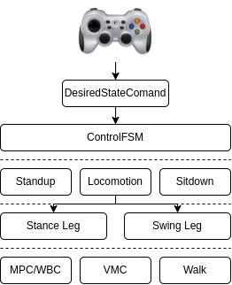

- [0. command](#0-command)
  - [step1](#step1)
  - [step2](#step2)
  - [step 3](#step-3)
- [debug](#debug)
- [1. Overview](#1-overview)
- [2. Source Code Structure](#2-source-code-structure)
- [3. Build the Project](#3-build-the-project)
  - [Step 1: Install the third party dependencies](#step-1-install-the-third-party-dependencies)
  - [Step 2: Compile the codes](#step-2-compile-the-codes)
- [4. Run the Project in Gazebo Simulator](#4-run-the-project-in-gazebo-simulator)
  - [Step 2: Start the Gazebo simulator and load a robot](#step-2-start-the-gazebo-simulator-and-load-a-robot)
  - [Step 3: Run an example](#step-3-run-an-example)
- [5. Control A Robot to Move Around using Keyboard](#5-control-a-robot-to-move-around-using-keyboard)
  - [Step 2: Control robot by keyboard](#step-2-control-robot-by-keyboard)
- [6. Control A Robot to Move Around using Joystick](#6-control-a-robot-to-move-around-using-joystick)
- [7. Run on Real Robot](#7-run-on-real-robot)

# 0. command

```bash
roslaunch qr_gazebo gazebo_startup.launch wname:=earth &
roslaunch qr_gazebo model_spawn.launch rname:=a1 use_xacro:=true use_camera:=false
rosrun examples example_a1_sim
rosrun examples example_keyboard
  # L --> J
```

## step1

```bash
> roslaunch qr_gazebo gazebo_startup.launch wname:=earth

> rostopic list
/clock
/gazebo/link_states
/gazebo/model_states
/gazebo/parameter_descriptions
/gazebo/parameter_updates
/gazebo/performance_metrics
/gazebo/set_link_state
/gazebo/set_model_state
/rosout
/rosout_agg

> rosservice list
/gazebo/apply_body_wrench
/gazebo/apply_joint_effort
/gazebo/clear_body_wrenches
/gazebo/clear_joint_forces
/gazebo/delete_light
/gazebo/delete_model

/gazebo/pause_physics
/gazebo/reset_simulation
/gazebo/reset_world

/gazebo/get_joint_properties
/gazebo/set_joint_properties
/gazebo/get_light_properties
/gazebo/set_light_properties
/gazebo/get_link_properties
/gazebo/set_link_properties
/gazebo/get_link_state
/gazebo/set_link_state
/gazebo/get_model_state
/gazebo/set_model_state
/gazebo/get_physics_properties
/gazebo/set_physics_properties

/gazebo/get_model_properties
/gazebo/set_model_configuration

/gazebo/get_world_properties
/gazebo/set_parameters

/gazebo/get_loggers
/gazebo/set_logger_level

/gazebo/spawn_sdf_model
/gazebo/spawn_urdf_model
/gazebo/unpause_physics
/gazebo_gui/get_loggers
/gazebo_gui/set_logger_level
/rosout/get_loggers
/rosout/set_logger_level
```

## step2

```bash
> roslaunch qr_gazebo model_spawn.launch rname:=a1 use_xacro:=true use_camera:=false
# [ INFO] [1719646597.832750456]: gazebo_ros_control plugin is waiting for model URDF in parameter [/robot_description] on the ROS param server.
# [ INFO] [1719646598.134816049]: Loaded gazebo_ros_control.
/a1_gazebo/controller_manager/list_controller_types
/a1_gazebo/controller_manager/list_controllers
/a1_gazebo/controller_manager/load_controller
/a1_gazebo/controller_manager/reload_controller_libraries
/a1_gazebo/controller_manager/switch_controller
/a1_gazebo/controller_manager/unload_controller

/gazebo/apply_body_wrench
/gazebo/apply_joint_effort
/gazebo/clear_body_wrenches
/gazebo/clear_joint_forces
/gazebo/delete_light
/gazebo/delete_model
/gazebo/get_joint_properties
/gazebo/get_light_properties
/gazebo/get_link_properties
/gazebo/get_link_state
/gazebo/get_loggers
/gazebo/get_model_properties
/gazebo/get_model_state
/gazebo/get_physics_properties
/gazebo/get_world_properties
/gazebo/pause_physics
/gazebo/reset_simulation
/gazebo/reset_world
/gazebo/set_joint_properties
/gazebo/set_light_properties
/gazebo/set_link_properties
/gazebo/set_link_state
/gazebo/set_logger_level
/gazebo/set_model_configuration
/gazebo/set_model_state
/gazebo/set_parameters
/gazebo/set_physics_properties
/gazebo/spawn_sdf_model
/gazebo/spawn_urdf_model
/gazebo/unpause_physics
/gazebo_gui/get_loggers
/gazebo_gui/set_logger_level

/rosout/get_loggers
/rosout/set_logger_level
/spawn_model_ubuntu_4195_7100063672855841887/get_loggers
/spawn_model_ubuntu_4195_7100063672855841887/set_logger_level

> parameter
PARAMETERS
- /a1_gazebo/FL_calf_controller/joint: FL_calf_joint
- /a1_gazebo/FL_calf_controller/pid/d: 8.0
- /a1_gazebo/FL_calf_controller/pid/i: 0.0
- /a1_gazebo/FL_calf_controller/pid/p: 300.0
- /a1_gazebo/FL_calf_controller/type: unitree_legged_co...


- /a1_gazebo/FL_hip_controller/joint: FL_hip_joint
- /a1_gazebo/FL_hip_controller/pid/d: 5.0
- /a1_gazebo/FL_hip_controller/pid/i: 0.0
- /a1_gazebo/FL_hip_controller/pid/p: 100.0
- /a1_gazebo/FL_hip_controller/type: unitree_legged_co...

- /a1_gazebo/FL_thigh_controller/joint: FL_thigh_joint
- /a1_gazebo/FL_thigh_controller/pid/d: 8.0
- /a1_gazebo/FL_thigh_controller/pid/i: 0.0
- /a1_gazebo/FL_thigh_controller/pid/p: 300.0
- /a1_gazebo/FL_thigh_controller/type: unitree_legged_co...

- /a1_gazebo/FR_calf_controller/joint: FR_calf_joint
- /a1_gazebo/FR_calf_controller/pid/d: 8.0
- /a1_gazebo/FR_calf_controller/pid/i: 0.0
- /a1_gazebo/FR_calf_controller/pid/p: 300.0
- /a1_gazebo/FR_calf_controller/type: unitree_legged_co...

- /a1_gazebo/FR_hip_controller/joint: FR_hip_joint
- /a1_gazebo/FR_hip_controller/pid/d: 5.0
- /a1_gazebo/FR_hip_controller/pid/i: 0.0
- /a1_gazebo/FR_hip_controller/pid/p: 100.0
- /a1_gazebo/FR_hip_controller/type: unitree_legged_co...

- /a1_gazebo/FR_thigh_controller/joint: FR_thigh_joint
- /a1_gazebo/FR_thigh_controller/pid/d: 8.0
- /a1_gazebo/FR_thigh_controller/pid/i: 0.0
- /a1_gazebo/FR_thigh_controller/pid/p: 300.0
- /a1_gazebo/FR_thigh_controller/type: unitree_legged_co...

- /a1_gazebo/RL_calf_controller/joint: RL_calf_joint
- /a1_gazebo/RL_calf_controller/pid/d: 8.0
- /a1_gazebo/RL_calf_controller/pid/i: 0.0
- /a1_gazebo/RL_calf_controller/pid/p: 300.0
- /a1_gazebo/RL_calf_controller/type: unitree_legged_co...

- /a1_gazebo/RL_hip_controller/joint: RL_hip_joint
- /a1_gazebo/RL_hip_controller/pid/d: 5.0
- /a1_gazebo/RL_hip_controller/pid/i: 0.0
- /a1_gazebo/RL_hip_controller/pid/p: 100.0
- /a1_gazebo/RL_hip_controller/type: unitree_legged_co...

- /a1_gazebo/RL_thigh_controller/joint: RL_thigh_joint
- /a1_gazebo/RL_thigh_controller/pid/d: 8.0
- /a1_gazebo/RL_thigh_controller/pid/i: 0.0
- /a1_gazebo/RL_thigh_controller/pid/p: 300.0
- /a1_gazebo/RL_thigh_controller/type: unitree_legged_co...

- /a1_gazebo/RR_calf_controller/joint: RR_calf_joint
- /a1_gazebo/RR_calf_controller/pid/d: 8.0
- /a1_gazebo/RR_calf_controller/pid/i: 0.0
- /a1_gazebo/RR_calf_controller/pid/p: 300.0
- /a1_gazebo/RR_calf_controller/type: unitree_legged_co...

- /a1_gazebo/RR_hip_controller/joint: RR_hip_joint
- /a1_gazebo/RR_hip_controller/pid/d: 5.0
- /a1_gazebo/RR_hip_controller/pid/i: 0.0
- /a1_gazebo/RR_hip_controller/pid/p: 100.0
- /a1_gazebo/RR_hip_controller/type: unitree_legged_co...

- /a1_gazebo/RR_thigh_controller/joint: RR_thigh_joint
- /a1_gazebo/RR_thigh_controller/pid/d: 8.0
- /a1_gazebo/RR_thigh_controller/pid/i: 0.0
- /a1_gazebo/RR_thigh_controller/pid/p: 300.0
- /a1_gazebo/RR_thigh_controller/type: unitree_legged_co...
- /a1_gazebo/joint_state_controller/publish_rate: 1000
- /a1_gazebo/joint_state_controller/type: joint_state_contr...

- /robot_description: <?xml version="1....
- /rosdistro: noetic
- /rosversion: 1.16.0

> start controller
process[spawn_model_ubuntu_35308_1710532594375493026-1]: started with pid [35324]
[INFO] [1721537035.288955, 0.000000]: Loading model XML from ros parameter robot_description
[INFO] [1721537035.318440, 0.000000]: Waiting for service /gazebo/spawn_urdf_model
[INFO] [1721537035.323082, 0.000000]: Calling service /gazebo/spawn_urdf_model
[INFO] [1721537037.619846, 0.000000]: Spawn status: SpawnModel: Successfully spawned entity
[INFO] [1721537037.621866, 0.000000]: Unpausing physics
[ INFO] [1721537038.342880450, 0.273000000]: spawn model state: 0
[ INFO] [1721537040.344264617, 2.117000000]: Gazebo model spawn correctly
----------------------------------------------------------------
Press Enter key to start controllers.
----------------------------------------------------------------

[ INFO] [1721537501.937188354, 397.751000000]: success to call load_controller service
[ INFO] [1721537501.937691543, 397.752000000]: joint_state_controller load correctly
[ INFO] [1721537502.015547917, 397.801000000]: success to call load_controller service
[ INFO] [1721537502.015603174, 397.801000000]: FR_hip_controller load correctly
[ INFO] [1721537502.024301269, 397.803000000]: success to call load_controller service
[ INFO] [1721537502.024330538, 397.803000000]: FR_thigh_controller load correctly
[ INFO] [1721537502.043786846, 397.813000000]: success to call load_controller service
[ INFO] [1721537502.043821256, 397.813000000]: FR_calf_controller load correctly
[ INFO] [1721537502.059511544, 397.815000000]: success to call load_controller service
[ INFO] [1721537502.059541104, 397.815000000]: FL_hip_controller load correctly
[ INFO] [1721537502.077190662, 397.829000000]: success to call load_controller service
[ INFO] [1721537502.077225292, 397.829000000]: FL_thigh_controller load correctly
[ INFO] [1721537502.095650748, 397.836000000]: success to call load_controller service
[ INFO] [1721537502.095683529, 397.836000000]: FL_calf_controller load correctly
[ INFO] [1721537502.111114580, 397.845000000]: success to call load_controller service
[ INFO] [1721537502.111149447, 397.845000000]: RR_hip_controller load correctly
[ INFO] [1721537502.132087380, 397.860000000]: success to call load_controller service
[ INFO] [1721537502.132122414, 397.860000000]: RR_thigh_controller load correctly
[ INFO] [1721537502.152189145, 397.865000000]: success to call load_controller service
[ INFO] [1721537502.152220345, 397.865000000]: RR_calf_controller load correctly
[ INFO] [1721537502.166580581, 397.882000000]: success to call load_controller service
[ INFO] [1721537502.166625933, 397.882000000]: RL_hip_controller load correctly
[ INFO] [1721537502.184750615, 397.893000000]: success to call load_controller service
[ INFO] [1721537502.184802667, 397.893000000]: RL_thigh_controller load correctly
[ INFO] [1721537502.196721084, 397.904000000]: success to call load_controller service
[ INFO] [1721537502.196752404, 397.904000000]: RL_calf_controller load correctly
```

## step 3

```bash
> rosrun examples example_a1_sim

> rosservice list
rosservice type /a1_gazebo/controller_manager/list_controller_types
# > controller_manager_msgs/ListControllerTypes
rosservice type /a1_gazebo/controller_manager/list_controllers
# > controller_manager_msgs/ListControllers
rosservice type /a1_gazebo/controller_manager/load_controller
# > controller_manager_msgs/LoadController
rosservice type /a1_gazebo/controller_manager/reload_controller_libraries
# > controller_manager_msgs/ReloadControllerLibraries
rosservice type /a1_gazebo/controller_manager/switch_controller
# > controller_manager_msgs/SwitchController
rosservice type /a1_gazebo/controller_manager/unload_controller
# > controller_manager_msgs/UnloadController
rosservice type /a1_sim/get_loggers
# > ERROR: Unable to communicate with service [/a1_sim/get_loggers], address [rosrpc://ubuntu:54621]
rosservice type /a1_sim/set_logger_level
# > ERROR: Unable to communicate with service [/a1_sim/set_logger_level], address [rosrpc://ubuntu:54621]
rosservice type /gazebo/apply_body_wrench
# > gazebo_msgs/ApplyBodyWrench
rosservice type /gazebo/apply_joint_effort
# > gazebo_msgs/ApplyJointEffort
rosservice type /gazebo/clear_body_wrenches
# > gazebo_msgs/BodyRequest
rosservice type /gazebo/clear_joint_forces
# > gazebo_msgs/JointRequest
rosservice type /gazebo/delete_light
# > gazebo_msgs/DeleteLight
rosservice type /gazebo/delete_model
# > gazebo_msgs/DeleteModel
rosservice type /gazebo/get_joint_properties
# > gazebo_msgs/GetJointProperties
rosservice type /gazebo/get_light_properties
# > gazebo_msgs/GetLightProperties
rosservice type /gazebo/get_link_properties
# > gazebo_msgs/GetLinkProperties
rosservice type /gazebo/get_link_state
# > gazebo_msgs/GetLinkState
rosservice type /gazebo/get_loggers
# > roscpp/GetLoggers
rosservice type /gazebo/get_model_properties
# > gazebo_msgs/GetModelProperties
rosservice type /gazebo/get_model_state
# > gazebo_msgs/GetModelState
rosservice type /gazebo/get_physics_properties
# > gazebo_msgs/GetPhysicsProperties
rosservice type /gazebo/get_world_properties
# > gazebo_msgs/GetWorldProperties
rosservice type /gazebo/pause_physics
# > std_srvs/Empty
rosservice type /gazebo/reset_simulation
# > std_srvs/Empty
rosservice type /gazebo/reset_world
# > std_srvs/Empty
rosservice type /gazebo/set_joint_properties
# > gazebo_msgs/SetJointProperties
rosservice type /gazebo/set_light_properties
# > gazebo_msgs/SetLightProperties
rosservice type /gazebo/set_link_properties
# > gazebo_msgs/SetLinkProperties
rosservice type /gazebo/set_link_state
# > gazebo_msgs/SetLinkState
rosservice type /gazebo/set_logger_level
# > roscpp/SetLoggerLevel
rosservice type /gazebo/set_model_configuration
# > gazebo_msgs/SetModelConfiguration
rosservice type /gazebo/set_model_state
# > gazebo_msgs/SetModelState
rosservice type /gazebo/set_parameters
# > dynamic_reconfigure/Reconfigure
rosservice type /gazebo/set_physics_properties
# > gazebo_msgs/SetPhysicsProperties
rosservice type /gazebo/spawn_sdf_model
# > gazebo_msgs/SpawnModel
rosservice type /gazebo/spawn_urdf_model
# > gazebo_msgs/SpawnModel
rosservice type /gazebo/unpause_physics
# > std_srvs/Empty
rosservice type /gazebo_gui/get_loggers
# > roscpp/GetLoggers
rosservice type /gazebo_gui/set_logger_level
# > roscpp/SetLoggerLevel
rosservice type /rosout/get_loggers
# > roscpp/GetLoggers
rosservice type /rosout/set_logger_level
# > roscpp/SetLoggerLevel
rosservice type /spawn_model_ubuntu_4195_7100063672855841887/get_loggers
# > roscpp/GetLoggers
rosservice type /spawn_model_ubuntu_4195_7100063672855841887/set_logger_level
# > roscpp/SetLoggerLevel

> rostopic list
/a1_gazebo/FL_calf_controller/command
/a1_gazebo/FL_calf_controller/joint_wrench
/a1_gazebo/FL_calf_controller/state
/a1_gazebo/FL_hip_controller/command
/a1_gazebo/FL_hip_controller/joint_wrench
/a1_gazebo/FL_hip_controller/state
/a1_gazebo/FL_thigh_controller/command
/a1_gazebo/FL_thigh_controller/joint_wrench
/a1_gazebo/FL_thigh_controller/state
/a1_gazebo/FR_calf_controller/command
/a1_gazebo/FR_calf_controller/joint_wrench
/a1_gazebo/FR_calf_controller/state
/a1_gazebo/FR_hip_controller/command
/a1_gazebo/FR_hip_controller/joint_wrench
/a1_gazebo/FR_hip_controller/state
/a1_gazebo/FR_thigh_controller/command
/a1_gazebo/FR_thigh_controller/joint_wrench
/a1_gazebo/FR_thigh_controller/state
/a1_gazebo/RL_calf_controller/command
/a1_gazebo/RL_calf_controller/joint_wrench
/a1_gazebo/RL_calf_controller/state
/a1_gazebo/RL_hip_controller/command
/a1_gazebo/RL_hip_controller/joint_wrench
/a1_gazebo/RL_hip_controller/state
/a1_gazebo/RL_thigh_controller/command
/a1_gazebo/RL_thigh_controller/joint_wrench
/a1_gazebo/RL_thigh_controller/state
/a1_gazebo/RR_calf_controller/command
/a1_gazebo/RR_calf_controller/joint_wrench
/a1_gazebo/RR_calf_controller/state
/a1_gazebo/RR_hip_controller/command
/a1_gazebo/RR_hip_controller/joint_wrench
/a1_gazebo/RR_hip_controller/state
/a1_gazebo/RR_thigh_controller/command
/a1_gazebo/RR_thigh_controller/joint_wrench
/a1_gazebo/RR_thigh_controller/state
/a1_gazebo/joint_states
/clock
/gazebo/link_states
/gazebo/model_states
/gazebo/parameter_descriptions
/gazebo/parameter_updates
/gazebo/performance_metrics
/gazebo/set_link_state
/gazebo/set_model_state
/joy
/rosout
/rosout_agg
/tf
/trunk_imu
/visual/FL_foot_contact/the_force
/visual/FR_foot_contact/the_force
/visual/RL_foot_contact/the_force
/visual/RR_foot_contact/the_force
/xpp/params
/xpp/state_curr
/xpp/state_des
```

# debug

```bash
> rosservice call /gazebo/get_model_state "model_name: 'a1_gazebo'"

header:
  seq: 1
  stamp:
    secs: 500
    nsecs: 710000000
  frame_id: ''
pose:
  position:
    x: -0.03026398036198896
    y: 0.021486680178571322
    z: 0.2902044312809233
  orientation:
    x: -0.0025977188369381552
    y: -0.002292590699380101
    z: -0.047982515777219535
    w: 0.998842166743284
twist:
  linear:
    x: -1.601952362458282e-05
    y: 9.014322288913362e-05
    z: -0.00031542604317989244
  angular:
    x: 1.1839083251700746e-05
    y: 0.0015341154865489463
    z: 0.00018991785095419627
success: True
status_message: "GetModelState: got properties"
```

```bash
> rosservice call /gazebo/get_model_properties "model_name: 'a1_gazebo'"
parent_model_name: ''
canonical_body_name: ''
body_names:
  - base
  - FL_hip
  - FL_thigh
  - FL_calf
  - FR_hip
  - FR_thigh
  - FR_calf
  - RL_hip
  - RL_thigh
  - RL_calf
  - RR_hip
  - RR_thigh
  - RR_calf
geom_names:
  - base_fixed_joint_lump__trunk_collision
  - base_fixed_joint_lump__imu_link_collision_1
  - FL_hip_collision
  - FL_hip_fixed_joint_lump__FL_thigh_shoulder_collision_1
  - FL_thigh_collision
  - FL_calf_collision
  - FL_calf_fixed_joint_lump__FL_foot_collision_1
  - FR_hip_collision
  - FR_hip_fixed_joint_lump__FR_thigh_shoulder_collision_1
  - FR_thigh_collision
  - FR_calf_collision
  - FR_calf_fixed_joint_lump__FR_foot_collision_1
  - RL_hip_collision
  - RL_hip_fixed_joint_lump__RL_thigh_shoulder_collision_1
  - RL_thigh_collision
  - RL_calf_collision
  - RL_calf_fixed_joint_lump__RL_foot_collision_1
  - RR_hip_collision
  - RR_hip_fixed_joint_lump__RR_thigh_shoulder_collision_1
  - RR_thigh_collision
  - RR_calf_collision
  - RR_calf_fixed_joint_lump__RR_foot_collision_1
joint_names:
  - FL_hip_joint
  - FL_thigh_joint
  - FL_calf_joint
  - FR_hip_joint
  - FR_thigh_joint
  - FR_calf_joint
  - RL_hip_joint
  - RL_thigh_joint
  - RL_calf_joint
  - RR_hip_joint
  - RR_thigh_joint
  - RR_calf_joint
child_model_names: []
is_static: False
success: True
status_message: "GetModelProperties: got properties"
```

```bash
> rosservice call /gazebo/get_link_state "link_name: 'FL_hip_joint'"
link_state:
  link_name: ''
  pose:
    position:
      x: 0.0
      y: 0.0
      z: 0.0
    orientation:
      x: 0.0
      y: 0.0
      z: 0.0
      w: 0.0
  twist:
    linear:
      x: 0.0
      y: 0.0
      z: 0.0
    angular:
      x: 0.0
      y: 0.0
      z: 0.0
  reference_frame: ''
success: False
status_message: "GetLinkState: link not found, did you forget to scope the link by model name?"
```

```bash
> rostopic info /a1_gazebo/FL_calf_controller/state
Type: unitree_legged_msgs/MotorState

Publishers:
 * /gazebo (http://ubuntu:42717/)

Subscribers:
 * /a1_sim (http://ubuntu:42131/)

> rostopic echo /a1_gazebo/FL_calf_controller/state
---
mode: 0
q: -1.8372163772583008
dq: -13.69507884979248
ddq: 0.0
tauEst: -4.63516902923584
q_raw: 0.0
dq_raw: 0.0
ddq_raw: 0.0
temperature: 0
reserve: [0, 0]
---
mode: 0
q: -1.8505470752716064
dq: -13.458257675170898
ddq: 0.0
tauEst: -3.55810546875
q_raw: 0.0
dq_raw: 0.0
ddq_raw: 0.0
temperature: 0
reserve: [0, 0]
---
```

# 1. Overview

This project branch integrates some advanced algrithms such as MPC and WBC to control quadruped robots. This branch have been tested in **ROS Noetic** under **Ubuntu 20.04**. Some users report it can run in **ROS Melodic** under **Ubuntu 18.04**. To ensure optimal performance, we recommend testing this branch in **ROS Noetic** under **Ubuntu 20.04**. Note that this branch is different from the one in the `main` branch. The architecture and major modules are shown below The codes are tested for Unitree A1 and DeepRobotics Lite3. To fine-tune the MPC and WBC algorithms, you can adjust the corresponding parameters (e.g. KP and KD in **quadruped/src/controllers/wbc/task_set** or weights in WBC locomotion controller).


> 该项目分支集成了一些先进的算法，如 MPC 和 WBC 来控制四足机器人。此分支已在 `Ubuntu 20.04` 下的 `ROS Noetic` 中进行了测试。
> 这些代码针对 `Unitree A1` 和 `DeepRobotics Lite3` 进行了测试。要微调 MPC 和 WBC 算法，您可以调整相应的参数(例如 `quadruped/src/controllers/WBC/task_set` 中的 `KP` 和 `KD` 或 `WBC` 运动控制器中的权重)。

# 2. Source Code Structure

The source code includes five major directories

- **examples** contains a few examples to help users understand the usage and the project architecture.
- **quadruped** contains the major modules defining robots, controllers, planner, dynamics and supporting algorithms.
- **robot_description** contains the files needed to represent robot models.
- **simulation** contains the necessary environment to run examples in the simulator.
- **xpp** contains a visualization tool for robots.

> - `examples` 包含一些示例，帮助用户了解使用方法和项目架构；
> - `quadruped` 包含定义机器人、控制器、规划器、动力学和支持算法的主要模块；
> - `robot_description` 包含表示机器人模型所需的文件；
> - `simulation` 包含在模拟器中运行示例所需的环境；
> - `xpp` 包含一个机器人可视化工具；

# 3. Build the Project

## Step 1: Install the third party dependencies

Please ensure that all required dependencies have been installed before building the project

```bash
apt install libyaml-cpp-dev libeigen3-dev liblcm-dev libglm-dev
```

## Step 2: Compile the codes

Navigate to your workspace, build the project using ROS tool `catkin_make`

```bash
cd ${your_workspace}
catkin_make
```

If you have a less powerful machine, there are a few steps you can take to optimize the project performance.

> 如果你有一台功能较弱的机器，你可以采取一些步骤来优化项目性能。

- To improve simulation performance, navigate to the `.world` file (the default file is `earth.world`) located in the **simulation/qr_gazebo/worlds** folder and adjust the `<real_time_update_rate>`. The default value is 1000, but you can reduce it to 800 or lower. Observe the `<real_time_factor>` during simulation, if it falls below 1.0, you can further adjust the `<real_time_factor>` by reducing it to 0.9 or lower.

> - 要提高模拟性能，请导航到 `simulation/qr_gazebo/worlds` 文件夹中的 `.world` 文件(默认文件为 `earth.world`)，并调整 `<real_time_update_rate>`。默认值为 1000，但可以将其减少到 800 或更低。在模拟过程中观察 `<real_time_factor>`，如果它低于 1.0，您可以通过将其降低到 0.9 或更低来进一步调整 `<real_time_factor>`。

- Navigate to the "quadruped" folder, uncomment any `BLAS` related content in the "CMakeLists.txt" file if they are commented and then set the followihng option to `ON`, and ensure `libopenblas-dev` has been installed.

> - 导航到 `quadruped` 文件夹，取消注释 `CMakeLists.txt` 文件中任何与 `BLAS` 相关的内容(如果有注释)，然后将 following 选项设置为 `ON`，并确保已安装 `libopenblas-dev`。

```cmake
option(USE_BLAS "USE MKL BLAS" ON)
```

- To boost the performance of a program running on an Intel chip, consider using the MKL library. To install MKL, download the Intel oneAPI Math Kernel Library Offline Installer. After installation, execute the following command prior to running `catkin_make` on your workspace.

> - 要提高在英特尔芯片上运行的程序的性能，请考虑使用 MKL 库。要安装 MKL，请下载“英特尔 oneAPI 数学内核库脱机安装程序”。安装后，在工作区上运行`catkin_make`之前，请执行以下命令。

```bash
source /opt/intel/oneapi/setvars.sh
```

# 4. Run the Project in Gazebo Simulator

## Step 2: Start the Gazebo simulator and load a robot

```bash
source ${your_workspace}/devel/setup.bash
roslaunch qr_gazebo gazebo_startup.launch wname:=earth
```

The `wname` (optional) parameter specifies the world to be loaded in Gazebo. The default value is `earth`. In a new terminal, spawn a robot model and manage controllers in the simulation environment. Below is for loading a Unitree A1 robot.

> `wname`(可选)参数指定要在 Gazebo 中加载的世界。默认值为`earth`。
> 在一个新的终端中，生成一个机器人模型，并在模拟环境中管理控制器。

```bash
roslaunch qr_gazebo model_spawn.launch rname:=a1 use_xacro:=true use_camera:=false
roslaunch qr_gazebo model_spawn.launch rname:=lite3 use_xacro:=true use_camera:=false
```

- The `rname` (optional) parameter specifies the robot to be loaded in Gazebo. The default value is `a1`.
- The `use_xacro` (optional) parameter determines whether to load the model by `xacro` or `urdf`. The default value is `true`.
- The `use_camera` (optional) parameter controls whether to load camera model with the robot. The default value is `false`.

> - `rname`(可选)参数指定要加载到 Gazebo 中的机器人。默认值为`a1`。
> - `use_xacro`(可选)参数决定是通过`xacro`还是`urdf`加载模型。默认值为`true`。
> - `use_camera`(可选)参数控制是否用机器人加载相机模型。默认值为`false`。

**Note that, after executing the command above, press the `Enter` key to start a robot’s controller. The low-level controller is now active and ready to support the movement of a quadruped robot.**

> **请注意，在执行上述命令后，按下“Enter”键启动机器人的控制器。低级控制器现在处于活动状态，并准备支持四足机器人的运动**

## Step 3: Run an example

Here is an example to control Unitree robot A1 (or DeepRobotics Lite3) to move around. Please check the `user_parameters.yaml` file in the **quadruped/config** folder is properly configured for the robot.
If you want to switch from robot A1 to Lite3, modify the parameters in the `user_parameters.yaml` file and ensure they are set for the new robot. Then execute

> 这里是一个控制 Unitree 机器人 A1(或 DeepRobotics Lite3)四处移动的例子。请检查`quadruped/config`文件夹中的`user_parameters.yaml`文件是否已为机器人正确配置。
> 如果要从 robot A1 切换到 Lite3，请修改`user_parameters.yaml`文件中的参数，并确保为新 robot 设置了这些参数。然后执行

```bash
rosrun examples example_a1_sim
rosrun examples example_lite3_sim
```

# 5. Control A Robot to Move Around using Keyboard

## Step 2: Control robot by keyboard

```bash
rosrun examples example_keyboard
# L --> J
```

`K` : switch control mode
`J` : change the gait
`W` `A` `S` `D` : move forward, left, backward, right
`Q` `E` : rotate left, right
`L` : stop troting
`I` : sit down and exit

# 6. Control A Robot to Move Around using Joystick

Utilizing the ROS joy package, you can operate a quadruped robot by using a game joystick (e.g., Logitech F710) to send speed commands. Once you launch the joy node, activate joy-control mode by pressing the `A` button, then maneuver the joystick handle to control the robot to move.

> 利用 ROS joy，您可以通过使用游戏操纵杆(例如 Logitech F710)发送速度命令来操作四足机器人。
> 启动 joy 节点后，按下 `A` 按钮激活 joy-control 模式，然后操纵操纵杆手柄控制机器人移动。

```bash
apt install ros-${your_ros_version}-joy
rosrun joy joy_node
```

Control the quadruped robot using joystick handle.

`A` : switch joy-control mode
`X` : change the gait

Joystick : control robot's movement

`B` : stop troting
`Y` : sit down and exit

# 7. Run on Real Robot

Note that, if your code is running on an ARM architecture board (e.g. DeepRobotics Lite3), please navigate to the **quadruped** folder and add the following commands in the "CMakeLists.txt" file.

> 请注意，如果您的代码在 ARM 架构板上运行(例如 DeepRobotics Lite3)，请导航到 `quadruped` 文件夹，并在 `CMakeLists.txt` 文件中添加以下命令。

```cmake
set(CMAKE_C_COMPILER "aarch64-linux-gnu-gcc")
set(CMAKE_CXX_COMPILER "aarch64-linux-gnu-g++")
```

Launch a ROS master node. To run an example code on a real robot (A1), open a new terminal and execute

```bash
rosrun examples example_a1_real
# or
rosrun examples example_lite3_real
```
