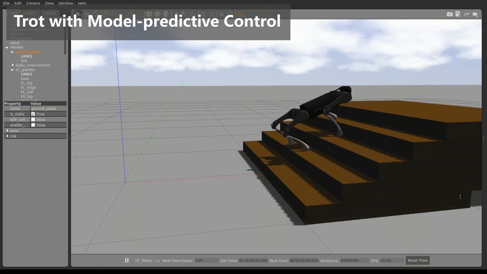

# The Open Source Quadruped-Robot \@TopHill Robotics

This project is developed by Robot Motion and Vision Laboratory at East China Normal University.

This project provides an architecture and many key algorithms to control quadruped robots, including state estimation, gait generation, stance and swing leg controllers. Our codes is written in portable C++. Most of the types defined in the project begin with the qr prefix. Hopefully this is sufficient to avoid name clashing with your program.

> 该项目提供了控制四足机器人的架构和许多关键算法，包括状态估计、步态生成、站姿和摆动腿控制器。我们的代码是用可移植的 C++ 编写的。项目中定义的大多数类型都以 qr 前缀开头。希望这足以避免与您的程序发生名称冲突。

This project supports the quadruped robots designed by Unitree-robotics, Deep-robotics and Anymal. The codes were tested under ROS1 and Gazebo 9/11.

> 该项目支持 Unitree-robotics、Deep-robotics 和 Anymal 设计的四足机器人。代码在 ROS1 和 Gazebo 9/11 下进行了测试。

## Overview

This project provides an architecture and some key algorithms to control quadruped robots, including state estimator, gait generator, stance and swing leg controllers.

> 该项目提供了控制四足机器人的架构和一些关键算法，包括状态估计器、步态发生器、姿态和摆动腿控制器。

The project now supports A1 robot (Unitree-Robotics) and Lite2A robot (Deep-Robotics). This project can be easily extended to support other quadruped robots such as AlienGO/GO1 (Unitree-Robotics), Jueying/X20(Deep-Robotics) and Anymal. For more information about quadruped robots, check out the following websites

> 该项目目前支持 A1 机器人(Unitree-Robotics)和 Lite2A 机器人(Deep-Robotics)。该项目可轻松扩展以支持其他四足机器人，如 AlienGO/GO1 (Unitree-Robotics)、Jueying/X20(Deep-Robotics)和 Anymal。有关四足机器人的更多信息，请访问以下网站

- [Unitree Robotics](https://github.com/unitreerobotics)
- [Deep Robotics](https://www.deeprobotics.cn/)
- [AnyRobotics](https://www.anybotics.com/anymal-autonomous-legged-robot/)

{width="600px"}
{width="600px"}
{width="600px"}

## Source Code Structure

You can find the source code at [GitHub](https://github.com/TopHillRobotics/quadruped-robot/), including five major directories.

- **demo** has many demo examples to help users understand the software usage and the project architecture itself.
- **extern** contains the third-party dependencies to successfully compile and run the code.
- **navigation** contains the codes for SLAM and navigation.
- **quadruped** contains the core modules defining robots, state, planner, dynamics and supporting algorithms.
- **simulation** contains the configuration to run demos in simulation.

> - **demo** 包含许多演示示例，帮助用户了解软件用法和项目架构本身。
> - **extern** 包含成功编译和运行代码所需的第三方依赖项。
> - **navigation** 包含 SLAM 和导航的代码。
> - **quadruped** 包含定义机器人、状态、规划器、动力学和支持算法的核心模块。
> - **simulation** 包含在模拟中运行演示的配置。

## Installation

### Installing ROS

You need install ROS (Robot Operating System) first. We tested the codes under Ubuntu Linux and ROS 1 Melodic Morenia distribution. Other newer ROS distributions are supposed to be supported. Please visit <http://www.wiki.ros.org> for ROS installation.

### Cloning the source code.

```bash
cd ${workspace_dir}
mkdir src

cd ${workspace_dir}/src
catkin_init_workspace

git clone https://github.com/TopHillRobotics/quadruped-robot/
```

### Installing the following third party dependencies.

- Eigen3
- yaml-cpp
- lcm
- Quadprogpp
- ros

```bash
sudo apt install \
  libyaml-cpp-dev \
  libeigen3-dev \
  liblcm-dev \
  libglm-dev
```

### Building the codes.

```bash
cd ${workspace_dir}
catkin_make
```

Run `source devel/setup.bash` before launching the project.

## SLAM and Navigation

The SLAM (simultaneous localization and mapping) module contains algorithms and demos publicly available in ROS. SLAM is able to construct or update the map while at the same time keeping in track the location of the mobile robot. Navigation module contains algorithms and demos that allow a mobile robot perform motion planning and autonomous navigation. Autonomous navigation often requires generating the map of the surrounding environment in order to navigate safely. A map is often created by sensors such as camera, sonar and laser sensor. Below are some snapshots of SLAM and navigation.

> SLAM(同时定位和映射)模块包含 ROS 中公开的算法和演示。SLAM 能够构建或更新地图，同时跟踪移动机器人的位置。导航模块包含允许移动机器人执行运动规划和自主导航的算法和演示。自主导航通常需要生成周围环境的地图，以便安全导航。地图通常由相机、声纳和激光传感器等传感器创建。以下是 SLAM 和导航的一些快照。

{height="300px"}
{height="300px"}

### Source Code Structure

You can find the source code of the SLAM and navigation modules at <https://github.com/TopHillRobotics/quadruped-robot/tree/develop/navigation>. It includes three directories.

> 您可以在上找到 SLAM 和导航模块的源代码<https://github.com/TopHillRobotics/quadruped-robot/tree/develop/navigation>. 它包括三个目录。

- **sensor_gazebo_plugin** contains the Gazebo plugins of a few widely used sensors.
- **slam** contains algorithms and demos, such as radar-based gmapping and cartographer that are widely used in ROS. Some other SLAM frameworks, such as vision-based ORB-SLAM2, vision and IMU fusion ORB-SLAM3, vision and IMU fusion LVI-SAM, IMU and GPS fusion LIO-SAM, radar, etc.
- **navigation** contains algorithms and demos for path planning and autonomous navigation.

> - **sensor_gazebo_plugin** 包含一些广泛使用的传感器的 Gazebo 插件。
> - **slam**包含算法和演示，如 ROS 中广泛使用的基于雷达的 gmapping 和 cartographer。其他一些 SLAM 框架，如基于视觉的 ORB-SLAM2、视觉与 IMU 融合 ORB-SLAM3、视觉与 IMU 融合 LVI-SAM、IMU 与 GPS 融合 LIO-SAM、雷达等。
> - **navigation**包含路径规划和自主导航的算法和演示。

### Installation

- **Installing gmapping**

As a ROS node, the gmapping package provides laser-based SLAM. Using gmapping, you can create a 2D occupancy grid map from laser and pose data collected by a mobile robot either in simulation or in real environment. The gmapping package is integrated in ROS, you can just run it. Visit <https://wiki.ros.org/slam_gmapping> for more details. In case you don\'t have gmapping installed, run the following code to install gmapping.

> 作为 ROS 节点，gmapping 包提供基于激光的 SLAM。使用 gmapping，您可以根据移动机器人在模拟或真实环境中收集的激光和姿态数据创建二维占用网格图。gmapping 包集成在 ROS 中，您只需运行即可。访问<https://wiki.ros.org/slam_gmapping>了解更多详细信息。如果您没有安装 gmapping，请运行以下代码来安装 gmapping。

```bash
sudo apt install ros-<ROS_DISTRO>-gmapping
```

You also need install the pointcloud_to_laserscan ROS package in order to convert 3D point cloud to 2D laser.

> 您还需要安装 pointcloud_to_laserscan ROS 包，以便将 3D 点云转换为 2D 激光。

```bash
sudo apt install ros-<ROS_DISTRO>-pointcloud-to-laserscan
```

- **Installing cartographer**

The cartographer_ros package is available in ROS. In case you don\'t have cartographer installed, run the following code to install cartographer.

> 在 ros 中提供了 mapper_ros 包。如果您没有安装制图器，请运行以下代码来安装制图器。

```bash
sudo apt install \
  ros-<ROS_DISTRO>-cartographer-ros \
  ros-<ROS_DISTRO>-cartographer-rviz
```

In some ROS version, cartographer may not be directly supported. Then you need to install cartographer from source <https://github.com/cartographer-project/cartographer>. Refer to <https://google-cartographer-ros.readthedocs.io/en/latest/> for more details about cartographer ROS integration.

> 在某些 ROS 版本中，可能不直接支持制图师。然后您需要从源位置安装制图器<https://github.com/cartographer-project/cartographer>. 提到https://google-cartographer-ros.readthedocs.io/en/latest/>有关制图师ROS集成的更多详细信息。

### Running Demos

First, in one terminal, source the [setup.bash]{.title-ref} to set up the environment

> 首先，在一个终端中，获取[setup.bash]以设置环境

```bash
source ${workspace_dir}/devel/setup.bash
```

Second, run the Gazebo simulator and load a robot.

```bash
roslaunch qr_gazebo normal.launch rname:=a1 wname:=mini_maze use_xacro:=true use_lidar:=true
```

Here, **rname** specifies the robot you use, **wname** specifies the Gazebo world that you use, **use_xacro** indicates if you use URDF or XACRO file, **use_lidar** specifies if you use lidar or not.

> 这里，**rname**指定您使用的机器人，**wname**指定您所使用的 Gazebo 世界，**use_xacro**指示您是否使用 URDF 或 xacro 文件，**use_lidar**指定您是否使用激光雷达。

Third, in a new terminal, launch a SLAM demo (see the following commands). It starts the rviz node and the demo_trot_keyboard. Using keyboard, you can control the robot moving and generate a map.

> 第三，在新的终端中，启动 SLAM 演示(请参阅以下命令)。它启动 rviz 节点和 demo_trot_keyboard。使用键盘，您可以控制机器人的移动并生成地图。

You can launch slam_gmapping

```bash
rosrun demo demo_slam_gmapping
# Or you can launch cartographer
rosrun demo demo_slam_cartographer
```

For navigation, you can run the following demo

```bash
rosrun demo demo_navigation_2d_use_map
```

Here, you can use the 2D Nav Goal to let your robot move to the target position. You may chose the LiDAR or camera for obstacle avoidance. Note that, the maps are provided by the slam demos mentioned above. You can use map_server to save maps.

> 在这里，您可以使用 2D 导航目标让您的机器人移动到目标位置。您可以选择激光雷达或相机来避障。请注意，地图是由上面提到的 slam 演示提供的。您可以使用 map_server 来保存地图。

You can run the following demo, building map and perform navigation simultaneously

> 您可以同时运行以下演示、构建地图和执行导航

```bash
rosrun demo demo_navigation_2d_gmapping
```

In an analogous manner, you may use cartographer instead of gmapping.

## Hello World

The Hello World demo (`demo/demo_helloworld`) is a good exaple to understand the deployment of our code. The code can be used in Gazebo simulator or for a real quadruped robot. Here, we also use a Unitree A1 quadruped robot to explain the usage process.

> Hello World 演示 (`demo/demo_helloworld`)是了解代码部署的一个很好的例子。该代码可用于 Gazebo 模拟器或真正的四足机器人。在此，我们也使用 Unitree A1 四足机器人来解释使用过程。

- `Hello World in Simulation`{.interpreted-text role="ref"}
- `Hello World in Real Environments`{.interpreted-text role="ref"}

## Hello World in Real Environments

The Hello World demo (`demo/demo_helloworld`) is also a good exaple to understand the deployment of our code on a real quadruped robot. Here, we also use a Unitree A1 quadruped robot to explain the process.

> Hello World 演示(“demo/demo_helloworld”)也是一个很好的例子，可以理解我们的代码在真实的四足机器人上的部署。在这里，我们还使用 Unitree A1 四足机器人来解释这个过程。

### Initializing the ROS node

Since our code is developped in ROS, we need initializing the ROS node first. Using ROS components, our program can communicate to other programs.

> 由于我们的代码是在 ROS 中开发的，我们需要首先初始化 ROS 节点。使用 ROS 组件，我们的程序可以与其他程序通信。

```cpp
ros::init(argc, argv, "demo_helloworld");
ros::NodeHandle nh;
```

### Getting the YMAL path

Every demo has its own configuration and parameters. These parameters are stored in a `.yaml` file. We need tell where the `.yaml` is and later we can load parameters from the given `.yaml` file. In this example, a Unitree A1 robot is used and its configurations are store in `demo_helloworld/real_config` for a real robot. We set a robot name as A1, then we will get the directory `demo/demo_helloworld`.

> 每个演示都有自己的配置和参数。这些参数存储在“.yaml”文件中。我们需要知道“.yaml”在哪里，稍后我们可以从给定的“.yaml”文件加载参数。在本例中，使用 Unitree A1 机器人，其配置存储在真实机器人的“demo_helloworld/real_config”中。我们将机器人名称设置为 A1，然后我们将获得目录“demo/demo_helloworld”。

```cpp
std::string pathToPackage = ros::package::getPath("demo");
std::string pathToNode =  pathToPackage + ros::this_node::getName();
std::string robotName = "a1";
```

The first two lines are unnecessary in the Hello World demo. However, they may be useful in other demos.

> 在 Hello World 演示中，前两行是不必要的。但是，它们可能在其他演示中有用。

### Creating a robot

We set the parameter `isSim` to `false` on the ROS Parameter Server. Then we create a robot (Unitree A1) using the specified parameters stored in the `demo/demo_helloworld/real_config/main.yaml` file.

> 我们在 ROS 参数服务器上将参数“isSim”设置为“false”。然后，我们使用存储在“demo/demo_helloworld/real_config/main.yaml”文件中的指定参数创建一个机器人(Unitree A1)。

```cpp
nh.setParam("isSim", false);
qrRobot *quadruped = new qrRobotReal(robotName, LocomotionMode::VELOCITY_LOCOMOTION);
```

We also need initialize a few robot properties by receiving observation from the real robot.

> 我们还需要通过接收来自真实机器人的观测来初始化一些机器人属性。

```cpp
quadruped->ReceiveObservation();
```

### Executing actions

Now the initiliazation is finished. We are ready to execute standing actions. First, we let the robot perform the first action, standing up. It takes 3 seconds to stand up and keep 5 seconds before any other action. The parameter 0.001 is the specified time step (control frequency is 1000Hz). You may try different arguments to understand the action.

> 现在初始化完成。我们已准备好执行长期行动。首先，我们让机器人做第一个动作，站起来。站起来需要 3 秒钟，在做任何其他动作之前保持 5 秒钟。参数 0.001 是指定的时间步长(控制频率为 1000Hz)。你可以尝试不同的论据来理解这个动作。

```cpp
Action::StandUp(quadruped, 3.f, 5.f, 0.001f);
```

After standing up we let the quadruped robot keep standing for 20 seconds, and the control frequency is also 1000Hz.

> 站起来后，我们让四足机器人保持站立 20 秒，控制频率也是 1000Hz。

```cpp
Action::StandUp(quadruped, 3.f, 5.f, 0.001f);
```

Finally the quadruped robot will sit down in 3 seconds with 1000Hz control frequency.

> 最后，四足机器人将在 3 秒内以 1000Hz 的控制频率坐下。

```cpp
Action::StandUp(quadruped, 3.f, 5.f, 0.001f);
```

### Finishing and shutting down the ROS node

After the demo is finished, we shut down the ROS nodes.

```cpp
ros::shutdown();
```

### Launching the demo

You can run a demo for a real quadruped robot either using your own external computer or a built-in miniPC (refer to A1 user manual). If you want to control the robot using your own computer, you need to connect your computer directly to the real quarduped robot with either an Ethernet cable or WiFi. This network connection allows a quarduped robot to communicate with your computer. Please refer to A1 user manual for how to build a connection.

> 您可以使用自己的外部计算机或内置迷你电脑(请参阅 A1 用户手册)为真实的四足机器人运行演示。如果你想用自己的电脑控制机器人，你需要用以太网电缆或 WiFi 将电脑直接连接到真正的 Quaduped 机器人。这种网络连接允许一个被隔离的机器人与您的计算机进行通信。有关如何建立连接，请参阅 A1 用户手册。

Make sure to keep the robot sufficiently charged and turn on the robot.

To run the demo, in one terminal, source the setup.bash to set up the environment

> 要运行演示，请在一个终端中获取 setup.bash 以设置环境

```cpp
source ${workspace_dir}/devel/setup.bash
```

Second, run roscore to start ROS since a real robot use LCM and ROS for communication. Please open a new terminal to run this command.

> 其次，运行 roscore 启动 ROS，因为真正的机器人使用 LCM 和 ROS 进行通信。请打开一个新的终端来运行此命令。

```cpp
roscore
```

Third, in a new terminal, launch a demo and run the quadruped controller node. Here, a demo helloworld lets the quadruped robot stand up.

> 第三，在一个新的终端中，启动一个演示并运行四足动物控制器节点。在这里，一个演示 helloworld 让四足机器人站起来。

```cpp
rosrun demo demo_helloworld real
```

Here, `real` indicates that the demo is running in a real quadruped robot. Given a robot YAML configuration file such as XACRO or URDF, a qrRobotReal object is constructed.

> 这里，“real”表示演示是在一个真实的四足机器人中运行的。给定一个机器人 YAML 配置文件，如 XACRO 或 URDF，就会构建一个 qrRobotReal 对象。

## Hello World in Simulation

The Hello World demo (`demo/demo_helloworld`) is a good exaple to understand the logistic of running with our code. Here, we use a Unitree A1 quadruped robot to explain the helloworld demo.

> Hello World 演示(`demo/demo_helloworld`)是理解使用我们的代码运行的逻辑的一个很好的例子。在这里，我们使用 Unitree A1 四足机器人来解释 helloworld 演示。

### Initializzing the ROS node

Since our code is developped in ROS, we need initializing the ROS node first. Using ROS components, our program can communicate to other programs.

> 由于我们的代码是在 ROS 中开发的，我们需要首先初始化 ROS 节点。使用 ROS 组件，我们的程序可以与其他程序通信。

```cpp
ros::init(argc, argv, "demo_helloworld");
ros::NodeHandle nh;
```

### Getting the YMAL path

Every demo has its own configuration and parameters. These parameters are stored in a `.yaml` file. We need tell where the `.yaml` is and later we can load parameters from the given `.yaml` file. In this example, a Unitree A1 robot is used and its configurations are store in `demo_helloworld/sim_config` for simulation. We set a robot name as A1, then we will get the directory `demo/demo_helloworld`.

> 每个演示都有自己的配置和参数。这些参数存储在“.yaml”文件中。我们需要知道“.yaml”在哪里，稍后我们可以从给定的“.yaml”文件加载参数。在本例中，使用 Unitree A1 机器人，其配置存储在“demo_helloworld/sim_config”中用于模拟。我们将机器人名称设置为 A1，然后我们将获得目录“demo/demo_helloworld”。

```cpp
std::string pathToPackage = ros::package::getPath("demo");
std::string pathToNode =  pathToPackage + ros::this_node::getName();
std::string robotName = "a1";
```

The first two lines are unnecessary in the Hello World demo. However, they may be necessary in other demos.

> 在 Hello World 演示中，前两行是不必要的。但是，它们在其他演示中可能是必要的。

### Resetting the Gazebo controller and robot model

We reset the Gazebo simulator\'s controller and the robot model. This allows the Gazebo to reload the controller plugins and locate the robot at the given position and orientation. Note that, this can avoid relaunching the Gazebo every time when we re-run the helloword demo.

> 我们重置 Gazebo 模拟器的控制器和机器人模型。这允许 Gazebo 重新加载控制器插件，并将机器人定位在给定的位置和方向。请注意，这可以避免每次重新运行 hellowword 演示时重新启动 Gazebo。

```cpp
ResetRobotBySystem(nh);
```

### Creating a robot

After launching the Gazebo, we create a robot (Unitree A1) using the specified parameters stored in the `demo/demo_helloworld/sim_config/main.yaml` file.

> 启动 Gazebo 后，我们使用存储在“demo/demo_helloworld/sim_config/main.yaml”文件中的指定参数创建一个机器人(Unitree A1)。

```cpp
qrRobot *quadruped = new qrRobotSim(nh, robotName, LocomotionMode::VELOCITY_LOCOMOTION);
```

We also need initialize a few robot properties by receiving observation from Gazebo.

> 我们还需要通过接收 Gazebo 的观测来初始化一些机器人属性。

```cpp
quadruped->ReceiveObservation();
```

### Executing actions

Now the initiliazation is finished. We are ready to execute standing actions. First, we let the robot perform the first action, standing up. It takes 3 seconds to stand up and keep 5 seconds before any other action. The parameter 0.001 is the specified time step (control frequency is 1000Hz). You may try different arguments to understand the action.

> 现在初始化完成。我们已准备好执行长期行动。首先，我们让机器人做第一个动作，站起来。站起来需要 3 秒钟，在做任何其他动作之前保持 5 秒钟。参数 0.001 是指定的时间步长(控制频率为 1000Hz)。你可以尝试不同的论据来理解这个动作。

```cpp
Action::StandUp(quadruped, 3.f, 5.f, 0.001f);
```

After standing up we let the quadruped robot keep standing for 20 seconds, and the control frequency is also 1000Hz.

> 站起来后，我们让四足机器人保持站立 20 秒，控制频率也是 1000Hz。

```cpp
Action::StandUp(quadruped, 3.f, 5.f, 0.001f);
```

Finally the quadruped robot will sit down in 3 seconds with 1000Hz control frequency.

> 最后，四足机器人将在 3 秒内以 1000Hz 的控制频率坐下。

```cpp
Action::StandUp(quadruped, 3.f, 5.f, 0.001f);
```

### Finishing and shutting down the ROS node

After the demo is finished, we shut down the ROS nodes.

```cpp
ros::shutdown();
```

### Launching the demo

To run the demo, we first launch Gazebo, a high fidelity robot simulator widely used in ROS community. First, in one terminal, source the setup.bash to set up the environment

> 为了运行演示，我们首先推出 Gazebo，这是一款在 ROS 社区广泛使用的高保真机器人模拟器。首先，在一个终端中，获取 setup.bash 以设置环境

```cpp
source ${workspace_dir}/devel/setup.bash
```

Second, run the Gazebo simulator and load a robot.

```cpp
roslaunch qr_gazebo normal.launch
```

Third, in a new terminal, launch a demo and run the quadruped controller node. Here, a demo helloworld lets the quadruped robot stand up.

> 第三，在一个新的终端中，启动一个演示并运行四足动物控制器节点。在这里，一个演示 helloworld 让四足机器人站起来。

```cpp
rosrun demo demo_helloworld sim
```

or omit `sim` by default

```cpp
rosrun demo demo_helloworld
```

## References

1. www.ros.org
2. www.gazebosim.org
