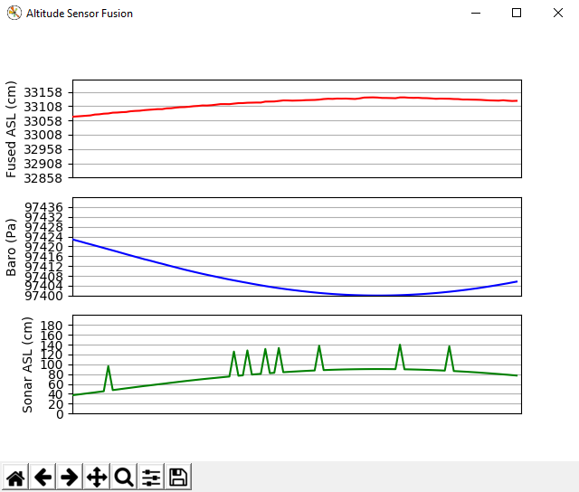

# TinyEKF: Lightweight C/C++ Extended Kalman Filter with Python for prototyping

> TinyEKF：使用 Python 进行原型开发的轻量级 C/C++ 扩展卡尔曼滤波器

TinyEKF is a simple C/C++ implementation of the [Extended Kalman Filter](http://home.wlu.edu/~levys/kalman_tutorial/) that is general enough to use on different projects. In order to make it practical for running on Arduino, STM32, and other microcontrollers, it uses static (compile-time) memory allocation (no "new" or "malloc"). The **examples** folder includes an Arduino example of sensor fusion. The **extras/python** folder includes an abstract Python class that you can use to prototype your EKF before implementing it in C/C++. The **extrasc/c** folder contains a "pure C" example from the literature.

> TinyEKF 是[扩展卡尔曼滤波器](http://home.wlu.edu/~levys/kalman_tutorial/) 的一个简单 C/C++ 实现，通用性强，可用于不同项目。为了让它能在 Arduino、STM32 和其他微控制器上运行，它使用了静态(编译时)内存分配(没有 "new "或 "malloc")。**examples**文件夹包含一个传感器融合的 Arduino 示例。**extras/python** 文件夹包含一个抽象 Python 类，在用 C/C++ 实现 EKF 之前，您可以用它来构建 EKF 的原型。**extrasc/c** 文件夹包含一个文献中的 "纯 C "示例。

Arduino users can simply install or drag the whole TinyEKF folder into their Arduino libraries folder. The **examples/SensorFusion** folder contains a little sensor fusion example using a [BMP180 barometer](https://www.sparkfun.com/products/11824) and [LM35 temperature sensor](http://www.robotshop.com/en/dfrobot-lm35-linear-temperature-sensor.html). I have run this example on an Arduino Uno and a Teensy 3.2. The BMP180, being an I^2C sensor, should be connected to pins 4 (SDA) and 5 (SCL) of the Uno, or pins 18 (SDA) and 19 (SCL) of the Teensy. For other Arduino boards, consult the [documentation](https://www.arduino.cc/en/Reference/Wire) on the Wire library. The analog output from the LM35 should go to the A0 pin of your Arduino or Teensy.

> Arduino 用户只需安装或将整个 TinyEKF 文件夹拖入其 Arduino 库文件夹即可。**examples/SensorFusion** 文件夹包含一个使用 [BMP180 气压计](https://www.sparkfun.com/products/11824) 和 [LM35 温度传感器](http://www.robotshop.com/en/dfrobot-lm35-linear-temperature-sensor.html) 的传感器融合示例。我在 Arduino Uno 和 Teensy 3.2 上运行了这个示例。BMP180 是 I^2C 传感器，应连接到 Uno 的引脚 4(SDA)和 5(SCL)，或 Teensy 的引脚 18(SDA)和 19(SCL)。关于其他 Arduino 板，请查阅 Wire 库的 [文档](https://www.arduino.cc/en/Reference/Wire)。LM35 的模拟输出应连接到 Arduino 或 Teensy 的 A0 引脚。

In addition to the class definition, the **extras/python** folder has an example of mouse tracking, using OpenCV. So you will have to install OpenCV to run this example. There is also a sensor-fusion example in this folder, which uses the [RealtimePlotter](https://github.com/simondlevy/RealtimePlotter) package, requiring Matplotlib.

> 除类定义外，**extras/python** 文件夹中还有一个使用 OpenCV 跟踪鼠标的示例。因此，你必须安装 OpenCV 才能运行这个示例。该文件夹中还有一个传感器融合示例，它使用了[RealtimePlotter](https://github.com/simondlevy/RealtimePlotter)软件包，需要 Matplotlib。
